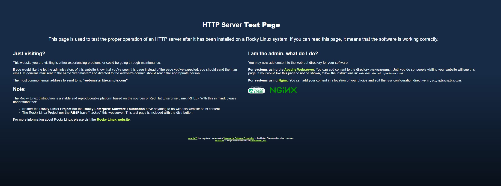
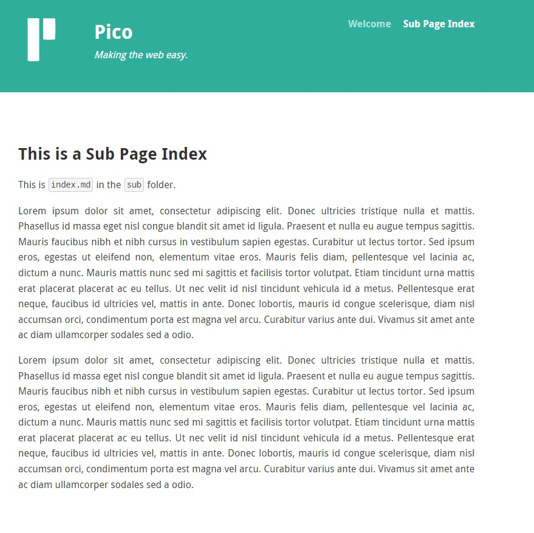

- Identité : Bureau Mathis

# Activité 1 : création de la VM et Configuration Rocky Linux (temps total additionné : 20min)

## Connexion à proxmox et création VM (temps passé : 10min)

- Se connecter à ProxMox et effectuer un clic-droit sur "cfai-2024" et "create VM".

- Suivre les instruction jusqu'à arriver à ce résultat :


- Démarrer la VM

## Configuration rocky linux (temps passé : 10min)

- Suivre les instructions d'installation :
    - Définir pwd root
    - Définir utilisateur mbureau administrateur
    - Définir la gestion des partitions (voir image suivante)
    - Confirmer et attendre l'installation 
    - Redémarrer la VM et se connecter


 
# Activité 2 : Configuration du réseau (temps total additionné 40min)

## Ajout de l'ipv6 manuelle (temps passé 30min)
- Récupérer l'ipv6 automatique (2a03:5840:111:1024:be24:11ff:fe6d:f34a)
- Sur Rocky utiliser le CLI NetworkManager pour ajouter l'ip
    - 2a03:5840:111:1024::8/64

- Tout d'abord utiliser les commandes suivantes pour autoriser le fait d'avoir de multiples ipv6 :

```
nmcli connection modify ens18 ipv6.addr-gen-mode eui64
nmcli connection modify ens18 ipv6.method auto
nmcli connection modify ens18 ipv6.ip6-privacy 2
```

- Utiliser ensuite les commande suivante :

```
sudo nmcli connection edit ens18
set ipv6.addresses 2a03:5840:111:1024::8/64
save
quit
```

- Redémarrer le service NetworkManager (sudo systemctl restart NetworkManager)
- Vérifier le résultat avec "ip -6 addr show"

## Ajout dans le DNS (temps passé 10min)
- Suivre les instructions du site "http://ns1.cfai2024.ajformation.fr:5000"


# Activité 3 : Configuration des utilisateurs et des groupes (temps passé 30min)
- Répéter l'opération suivante pour tous les utilisateurs à créer :

```
sudo adduser jmujalli
sudo passwd jmujalli

```

- Créer les groupes et ajouter les utilisateurs :
```
groupadd cplr
groupadd vitrine
groupadd gestion

usermod -aG vitrine webmaster
usermod -aG vitrine mbureau
usermod -aG vitrine jmujalli

usermod -aG gestion webmaster
usermod -aG gestion mbureau
usermod -aG gestion rwarner
```

# Activité 4 : Gestion de la hiérarchie des dossiers (temps passé 30min)
- Effectuer les commandes suivantes : 
```
mkdir -p /websites/vitrine
mkdir -p /websites/gestion

chown webmaster:vitrine /websites/vitrine
chown webmaster:gestion /websites/gestion
chmod 775 /websites/vitrine
chmod 775 /websites/gestion
```

- Avant d'effectuer la hiérarchie sur le dossier "/websites" il faut installer tous les paquets nécessaires (notamment nginx qui va créer un user) :
```
sudo dnf install -y openssh-server gcc make net-snmp nginx mysql php php-fpm php-mysqlnd
sudo usermod -aG cplr nginx
sudo chown -R nginx:cplr /websites
sudo chmod -R 775 /websites
```

- les utilisateurs sont créés, les dossiers aussi, les autorisations sont en place et les groupes aussi. Il va maintenant falloir passer à l'installation de pico cms et YetiForce ainsi qu'à la configuration de nginx.

# Activité 5 : Installation initiale des sites web (temps passé 10min)

## Pico CMS :
- Effectuer les commandes suivantes : 
```
cd /websites/vitrine
sudo curl -LO https://github.com/picocms/Pico/releases/download/v2.1.4/pico-release-v2.1.4.tar.gz
sudo tar -xzvf pico-release-v2.1.4.tar.gz
```

## YetiForce :
- Effectuer les commandes suivantes : 
```
cd /websites/gestion
sudo curl -LO https://github.com/YetiForceCompany/YetiForceCRM/releases/download/6.4.0/YetiForceCRM-6.4.0-complete.zip
sudo unzip YetiForceCRM-6.4.0-complete.zip
```

# Activité 6 : configuration de nginx (temps passé 4h)

## Création des fichiers de configuration :
```
sudo nano /etc/nginx/conf.d/central-cowboy.web.conf

server {
    listen [::]:80;
    server_name central-cowboy.web.cfai24.ajformation.fr;

    root /websites/vitrine;
    index index.php index.html index.htm;

    location / {
        try_files $uri $uri/ /index.php?$args;
    }

    location ~ \.php$ {
        include /etc/nginx/fastcgi_params;
        fastcgi_pass unix:/run/php-fpm/www.sock;
        fastcgi_param SCRIPT_FILENAME $document_root$fastcgi_script_name;
        include fastcgi_params;
    }
}

save & quit

sudo nano /etc/nginx/conf.d/central-cowboy.admin.conf

server {
    listen [::]:80;
    server_name central-cowboy.admin.cfai24.ajformation.fr;

    root /websites/gestion;
    index index.php index.html index.htm;

    location / {
        try_files $uri $uri/ /index.php?$args;
    }

    location ~ \.php$ {
        include /etc/nginx/fastcgi_params;
        fastcgi_pass unix:/run/php-fpm/www.sock;
        fastcgi_param SCRIPT_FILENAME $document_root$fastcgi_script_name;
        include fastcgi_params;
    }
}

save & quit
 ```

- Ajouter des règles au pare-feu pour autoriser le port 80 et 443 (http et https) :
```
sudo firewall-cmd --permanent --add-service=http
sudo firewall-cmd --permanent --add-service=https
sudo firewall-cmd --reload

sudo systemctl restart nginx

# Test de la connectivité localement avec curl
curl -I http://central-cowboy.web.cfai24.ajformation.fr
curl -I http://central-cowboy.admin.cfai24.ajformation.fr
```

- A ce moment j'ai commencé à rencontrer des erreurs innatendues, les deux liens me renvoient la page d'accueil nginx malgré ma configuration à priori correcte : 



- Il a fallu modifier le fichier de conf de nginx pour modifier la racine et la passer à "/websistes"

- Mais à ce moment malgré les droits réalisés sur les dossiers plus tôt les pages me renvoyaient "403 Forbidden" 

- Après avoir essayé de couper le pare-feu rien n'a changé

- L'erreur était due au fait que dans mes fichiers de configuration le paramètre "listen" était sur "80" et non pas sur "[::]:80" donc il n'écoutait pas en ipv6

# Activité 7 : configuration des sites web (temps passé 5h)

## Installation site vitrine (PicoCMS) et description des erreurs rencontrées : 
- Tout d'abord erreur 500 liée à une erreur PHP sur les 2 sites web
    - Installation du dépot remi-release-9 qui contient les anciennes versions de php :
    ```
    sudo dnf install epel-release
    sudo dnf install https://rpms.remirepo.net/enterprise/remi-release-9.rpm

    sudo dnf module list php
    sudo dnf module reset php
    sudo dnf module enable php:7.4

    sudo dnf install php74 php74-php-fpm php74-php-cli php74-php-mysqlnd
    ```
    - configuration de nginx pour utiliser la version de php souhaitée
    ```
    server {
    listen [::]:80;
    server_name central-cowboy.web.cfai24.ajformation.fr;

    root /websites/vitrine;
    index index.php index.html index.htm;

    location / {
        try_files $uri $uri/ /index.php?$query_string;
    }

    location ~ \.php$ {
        include fastcgi_params;
        fastcgi_pass unix:/run/php74-php-fpm/www.sock;
        fastcgi_param SCRIPT_FILENAME $document_root$fastcgi_script_name;
    }

    location ~ /\.ht {
        deny all;
    }}
    ```
    - Ceci a corrigé l'erreur 500 mais a provoqué une erreur "502 Bad Gateway" que j'ai corrigé en réinstallant pico via une installation avec composer et en gérant correctement ma socket php74 au lieu de la dernière version de php :
    
    ```
    cd /websites/vitrine
    # 2 extensions étaient manquantes je les ai donc téléchargées : 
    sudo dnf install php74-php-xml
    sudo dnf install php74-php-mbstring
    sudo systemctl restart php74-php-fpm


    curl -sSL https://getcomposer.org/installer | php74
    php74 composer.phar create-project picocms/pico-composer pico
    ```

    - J'ai rencontré une erreur à nouveau liée  à ma socket php-fpm (en version 7.4 cette fois ci), je n'avais pas enable le service, ainsi lors de redémarrage de ma machine j'ai été confronté à un service éteint qui ne démarrait pas et un dossier inexistant :

    ```
    sudo mkdir -p /run/php74-php-fpm
    sudo chown webmaster:webmaster /run/php74-php-fpm
    sudo chmod 755 /run/php74-php-fpm

    sudo systemctl restart php74-php-fpm
    sudo systemctl restart nginx    
    ```
    
    - Enfin il fallait modifier le paramètre "root" du fichier de conf du site vitrine côté nginx pour ajouter "/pico" à la la fin et le site web est disponible et configuré : 
    

