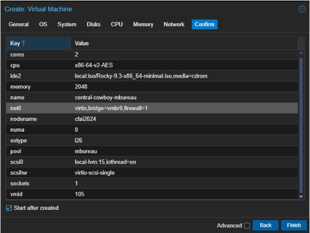
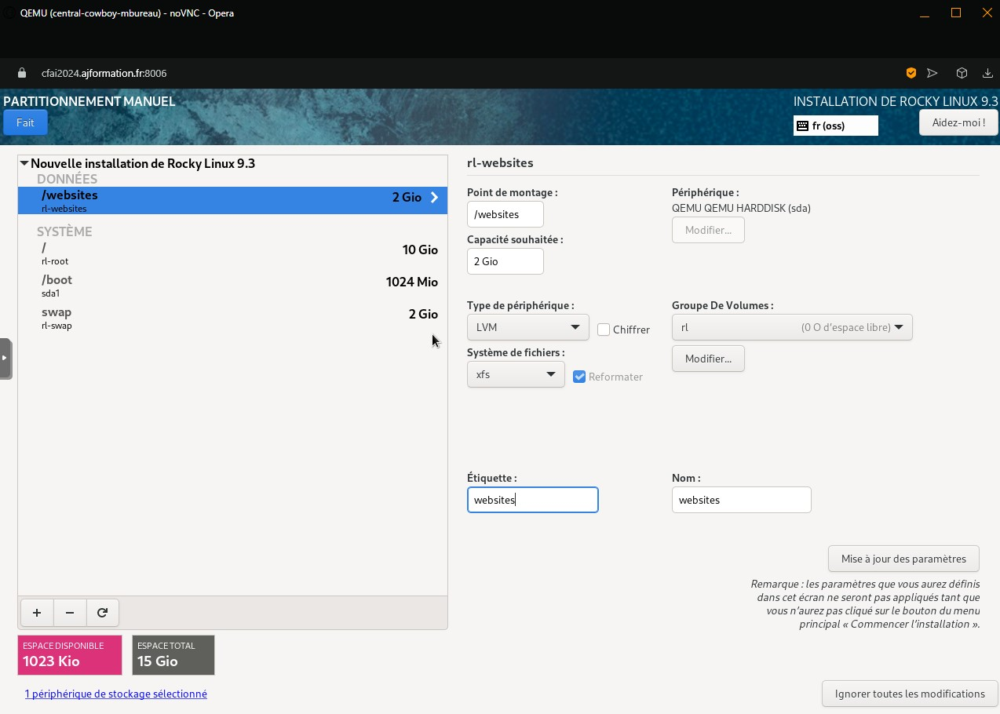
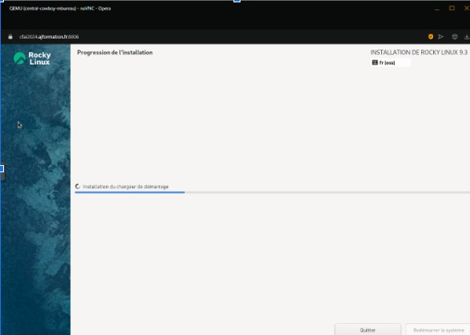
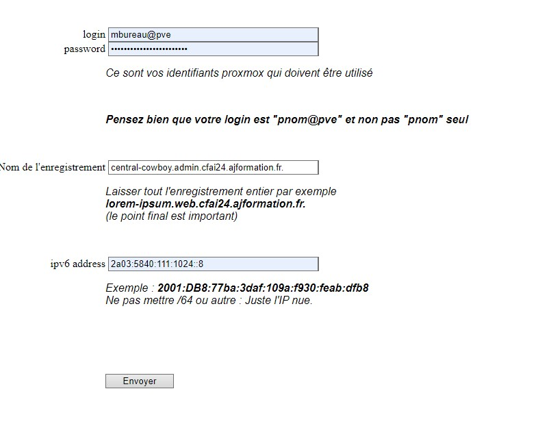

- Identité : Bureau Mathis

# Activité 1 : création de la VM et Configuration Rocky Linux (temps total additionné : 20min)

## Connexion à proxmox et création VM (temps passé : 10min)

- Se connecter à ProxMox et effectuer un clic-droit sur "cfai-2024" et "create VM".

- Suivre les instruction jusqu'à arriver à ce résultat :



- Démarrer la VM

## Configuration rocky linux (temps passé : 10min)

- Suivre les instructions d'installation :
    - Définir pwd root
    - Définir utilisateur mbureau administrateur
    - Définir la gestion des partitions (voir image suivante)
    - Confirmer et attendre l'installation 
    - Redémarrer la VM et se connecter





 
# Activité 2 : Configuration du réseau

## Ajout de l'ipv6 manuelle 
- Récupérer l'ipv6 automatique (2a03:5840:111:1024:be24:11ff:fe6d:f34a)
- Sur Rocky utiliser le CLI NetworkManager pour ajouter l'ip
    - 2a03:5840:111:1024::8/64

- Tout d'abord utiliser les commandes suivantes pour autoriser le fait d'avoir de multiples ipv6 :

```
nmcli connection modify ens18 ipv6.addr-gen-mode eui64
nmcli connection modify ens18 ipv6.method auto
nmcli connection modify ens18 ipv6.ip6-privacy 2
```

- Utiliser ensuite les commande suivante :

```
sudo nmcli connection edit ens18
set ipv6.addresses 2a03:5840:111:1024::8/64
save
quit
```

- Redémarrer le service NetworkManager (sudo systemctl restart NetworkManager)
- Vérifier le résultat avec "ip -6 addr show"

## Ajout dans le DNS
- Suivre les instructions du site "http://ns1.cfai2024.ajformation.fr:5000"



# Activité 3 : Configuration des utilisateurs et des groupes
- Répéter l'opération suivante pour tous les utilisateurs à créer :

```
sudo adduser jmujalli
sudo passwd jmujalli

```

- Créer les groupes et ajouter les utilisateurs :
```
groupadd cplr
groupadd vitrine
groupadd gestion

usermod -aG vitrine webmaster
usermod -aG vitrine mbureau
usermod -aG vitrine jmujalli

usermod -aG gestion webmaster
usermod -aG gestion mbureau
usermod -aG gestion rwarner
```

# Activité 4 : Gestion de la hiérarchie des dossiers
- Effectuer les commandes suivantes : 
```
mkdir -p /websites/vitrine
mkdir -p /websites/gestion

chown webmaster:vitrine /websites/vitrine
chown webmaster:gestion /websites/gestion
chmod 775 /websites/vitrine
chmod 775 /websites/gestion
```

- Avant d'effectuer la hiérarchie sur le dossier "/websites" il faut installer tous les paquets nécessaires (notamment nginx qui va créer un user) :
```
sudo dnf install -y openssh-server gcc make net-snmp nginx mysql php php-fpm php-mysqlnd
sudo usermod -aG cplr nginx
sudo chown -R nginx:cplr /websites
sudo chmod -R 775 /websites
```

- les utilisateurs sont créés, les dossiers aussi, les autorisations sont en place et les groupes aussi. Il va maintenant falloir passer à l'installation de pico cms et YetiForce ainsi qu'à la configuration de nginx.

# Activité 5 : Configuration des sites web

## Pico CMS :
- Effectuer les commandes suivantes : 
```
cd /websites/vitrine
sudo curl -LO https://github.com/picocms/Pico/releases/download/v2.1.4/pico-release-v2.1.4.tar.gz
sudo tar -xzvf pico-release-v2.1.4.tar.gz
```

## YetiForce :
- Effectuer les commandes suivantes : 
```
cd /websites/gestion
sudo curl -LO https://github.com/YetiForceCompany/YetiForceCRM/releases/download/6.4.0/YetiForceCRM-6.4.0-complete.zip
sudo unzip YetiForceCRM-6.4.0-complete.zip
```

# Activité 6 : configuration de nginx

## Création des fichiers de configuration :
```
sudo nano /etc/nginx/conf.d/central-cowboy.web.conf

server {
    listen 80;
    server_name central-cowboy.web.cfai24.ajformation.fr;

    root /websites/vitrine;
    index index.php index.html index.htm;

    location / {
        try_files $uri $uri/ /index.php?$args;
    }

    location ~ \.php$ {
        include /etc/nginx/fastcgi_params;
        fastcgi_pass unix:/run/php-fpm/www.sock;
        fastcgi_param SCRIPT_FILENAME $document_root$fastcgi_script_name;
        include fastcgi_params;
    }
}

save & quit

sudo nano /etc/nginx/conf.d/central-cowboy.admin.conf

server {
    listen 80;
    server_name central-cowboy.admin.cfai24.ajformation.fr;

    root /websites/gestion;
    index index.php index.html index.htm;

    location / {
        try_files $uri $uri/ /index.php?$args;
    }

    location ~ \.php$ {
        include /etc/nginx/fastcgi_params;
        fastcgi_pass unix:/run/php-fpm/www.sock;
        fastcgi_param SCRIPT_FILENAME $document_root$fastcgi_script_name;
        include fastcgi_params;
    }
}

save & quit
 ```

- Ajouter des règles au pare-feu pour autoriser le port 80 et 443 (http et https) :
```
sudo firewall-cmd --permanent --add-service=http
sudo firewall-cmd --permanent --add-service=https
sudo firewall-cmd --reload

sudo systemctl restart nginx

# Test de la connectivité localement avec curl
curl -I http://central-cowboy.web.cfai24.ajformation.fr
curl -I http://central-cowboy.admin.cfai24.ajformation.fr
```