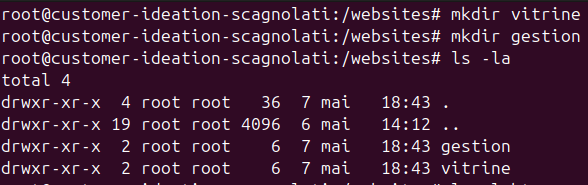
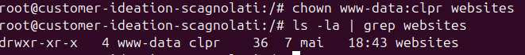
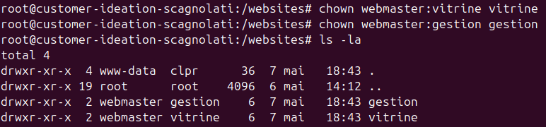
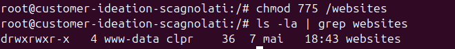
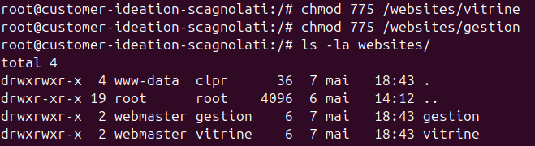

# Configuration de l'arborescence

La machine virtuelle devait présenter l'arborescence suivante :
- **/websites/**
    - **Owner** : Compte Serveur Web _(www-data)_
    - **Group** : clpr
    - **Droits** :
        - **u** : rwx
        - **g** : rwx
        - **o** : r-x
- **/websites/vitrine**
    - **Owner** : webmaster
    - **Group** : vitrine
    - **Droits** : 
        - **u** : rwx
        - **g** : rwx
        - **o** : r-x
- **/websites/gestion**
    - **Owner** : webmaster
    - **Group** : gestion
    - **Droits** : 
        - **u** : rwx
        - **g** : rwx
        - **o** : r-x

## Création des dossiers

```
mkdir /websites/vitrine
mkdir /websites/gestion
```



## Configuration des propriétés

```
chown www-data:clpr /websites/
chown webmaster:vitrine /websites/vitrine
chown webmaster:gestion /websites/gestion
```




## Configuration des droits

```
chmod 775 /websites
chmod 775 /websites/vitrine
chmod 775 /websites/gestion
```


