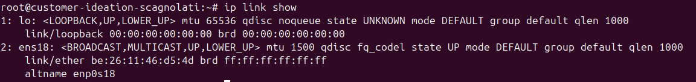

# Configuration du réseau

1. Déterminer l'adresse IPv6 SLAAC.

- L'adresse MAC de la machine est **BE:26:11:46:D5:4D**
- On inverse le 7ème bit de l'adresse MAC **BC:26:11:46:D5:4D**
- On insère FFFE au milieu de l'adresse MAC **BC26:11FF:FE46:D54D**
- On récupère le préfixe réseau **2A03:5840:111:1024**
- On ajoute l'adresse MAC au préfixe réseau **2A03:5840:111:1024:BC26:11FF:FE46:D54D**

> On retombe bien sur l'adresse IPv6 donnée à la création de ma machine.

2. Choix d'une adresse IPv6 fixe pour les sites web.

> Afin d'éviter les conflits, nous avons décidé de renseigner nos adresses IPv6 fixes dans un document [Administration Linux - IPv6](https://docs.google.com/spreadsheets/d/1V8o3TDtap5S8ppwWNqIwPzmyeoWmFgG2QRDR0904q9Y/edit#gid=0).
>
> On choisi donc une adresse IPv6 disponible en fonction de ce dernier.
>
> La grande réponse sur la vie, l'Univers et le reste étant disponible, on la sélectionne.

- **2A03:5840:111:1024::42**

3. Paramètrage des adresses IPv6 fixes.

- Pour paramétrer les adresses IPv6, on modifie le fichier **/etc/network/interfaces**

- On applique ensuite les modifications et on vérifie qu'elles sont prises en compte.

