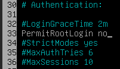
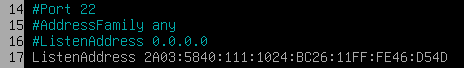
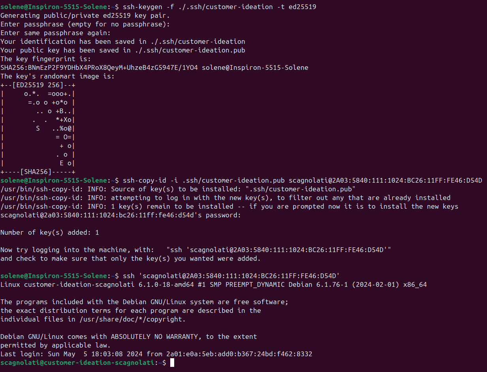
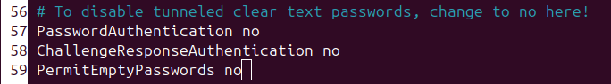

# Configuration du SSH

## Interdiction de la connexion en SSH via l'utilisateur root

- Pour interdire la connexion via l'utilisateur root, on modifie le fichier **/etc/ssh/sshd_config**
- On passe l'autorisation **PermitRootLogin** à **no**



- On redémarre le service

```
systemctl restart ssh
```

## Autorisation de la connexion SSH uniquement depuis l'adresse IPv6 2A03:5840:111:1024:BC26:11FF:FE46:D54D

- On modifie le fichier **/etc/ssh/sshd_config**
- On ajoute notre adresse IPv6 à la directive **ListenAddress**



- On redémarre le service

## Création d'une clé SSH pour la connexion

- On génère une clé SSH depuis notre utilisateur

```
ssh-keygen -f ./.ssh/customer-ideation -t ed25519
```

- On renseigne un mot de passe pour sécuriser la connexion via cette clé

- On copie ensuite cette clé sur le serveur

```
ssh-copy-id -i .ssh/customer-ideation.pub scagnolati@2A03:5840:111:1024:BC26:11FF:FE46:D54D
```



## Interdiction de se connecter via un mot de passe

- On modifie le fichier **/etc/ssh/sshd_config**
- On passe les autorisations **PasswordAuthentification**, **PermitEmptyPassword** et **ChallengeResponseAuthentication** à **no**



- On redémarre le service