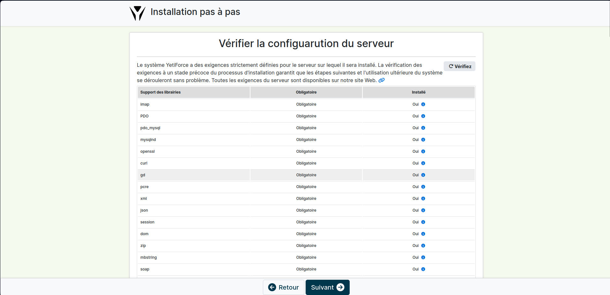

# Configuration des sites web

```
# Suppression du site Nginx par défaut
rm /etc/nginx/sites-available/default
rm /etc/nginx/sites-enabled/default

# Changement de l'utilisateur par défaut www-data
nano /etc/php/8.2/fpm/pool.d/www.conf 
```


## Configuration du site vitrine

```
# Création du fichier de configuration
nano /etc/nginx/sites-available/vitrine
```


```
# Création du lien symbolique
ln -s /etc/nginx/sites-available/vitrine /etc/nginx/sites-enabled/

# Redémarrage du service
systemctl restart nginx

# On build les sources du site
bundle exec jekyll build

# On modifie la configuration du site
cp /websites/vitrine/_config.yml /websites/vitrine/_config.yml.old
nano /websites/vitrine/_config.yml
```


- Le site est maintenant accessible !


## Configuration du site gestion

```
# Création du fichier de configuration
nano /etc/nginx/sites-available/gestion
```


```
# Création du lien symbolique
ln -s /etc/nginx/sites-available/gestion /etc/nginx/sites-enabled/

# Redémarrage du service
systemctl restart nginx

# Création d'une base de données pour YetiForce
mysql -u root -p
CREATE DATABASE yetiforce;
CREATE USER 'yetiforceuser'@'localhost' IDENTIFIED BY '*Y3t1F0rC3*';
GRANT ALL PRIVILEGES ON yetiforce.* TO 'yetiforceuser'@'localhost';
FLUSH PRIVILEGES;
exit;
```


```
# On installe ensuite les dépendances
composer install
```

- On configure ensuite le site à partir du navigateur




```
# On modifie la configuration PHP comme attendue par YetiForce
nano /etc/php/8.2/fpm/php.ini

# On applique les modification
systemctl restart php8.2-fpm
```

* [PHP Requirements](https://doc.yetiforce.com/introduction/requirements/#php-requirements)


```
# On modifie la configuration MySQL comme attendue par YetiForce
nano /etc/mysql/mysql.d.conf/mysqld.cnf

# On applique les modification
systemctl restart mysql
```

* [MySQL Requirements](https://doc.yetiforce.com/introduction/requirements/#database-engine-requirements-mariadbmysql)

> Certaines lignes ont dû être commentés à cause de l'erreur suivante :
>
> "unknow variable '...'"


### Erreur et résolution

> À cette étape, le site demande de vérifier son adresse mail pour pouvoir continuer
>
> Cependant, on remarque l'erreur suivante
>
> Failed to connect to https://api.yetiforce.eu/ port 443 after 40 ms: Couldn't connect to server for https://api.yetiforce.eu/emails

- On remarque que l'URL https://api.yetiforce.eu n'a pas d'IPv6 disponible. La machine ne disposant pas de stack IPv4, il n'est pas possible d'y accéder directement.


- Pour résoudre cette erreur, il faut :
1. Autoriser la connexion de root via SSH et via le FQDN customer-ideation.admin.cfai24.ajformation.fr
2. Ouvrir le port 443
3. Créer un tunnel à l'aide d'un **Remote Port Forwarding** entre notre machine et l'api.
```
ssh -R 443:api.yetiforce.eu:443 root@2a03:5840:111:1024::42
```

4. Modifier le **/etc/hosts**
```
127.0.0.1 api.yetiforce.eu
```

> Le site demande ensuite de renseigner les informations de l'entreprise
>
> On peut ensuite accéder aux services de YetiForce


