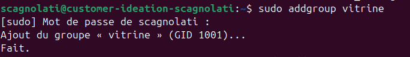
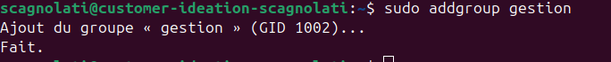
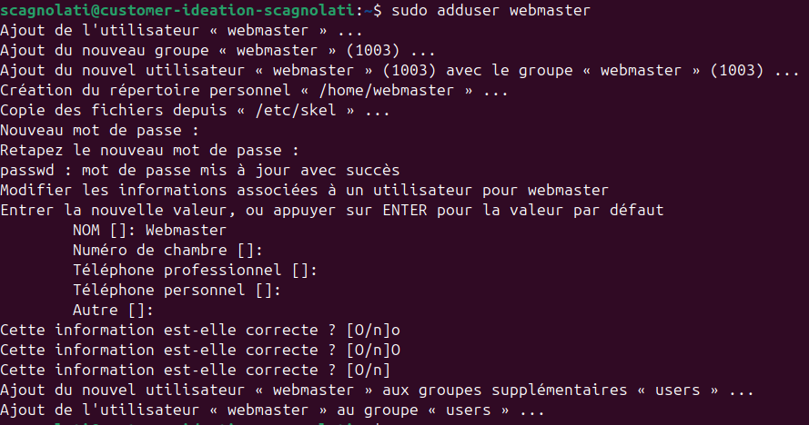
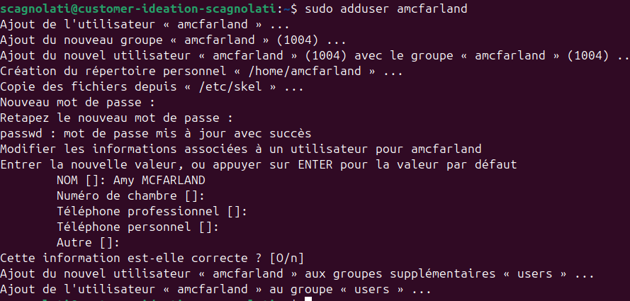
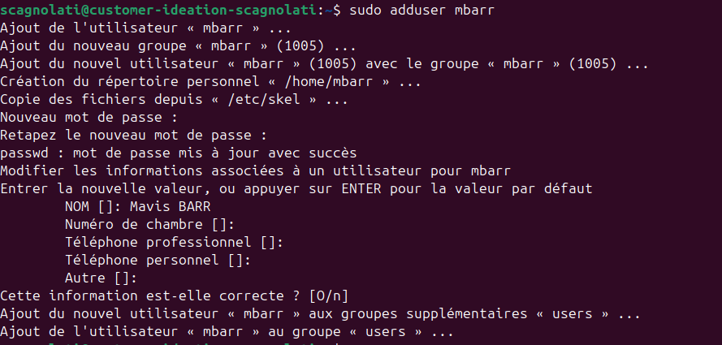
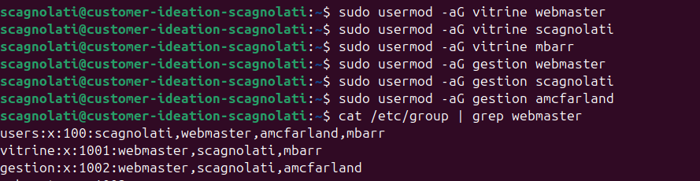

# Création des groupes

## Création du groupe clpr

```
addgroup clpr
```

## Création du groupe vitrine

```
addgroup vitrine
```



## Création du groupe gestion

```
addgroup gestion
```



# Création des utilisateurs

## Création du compte webmaster

```
adduser webmaster
```



## Création du compte amcfarland

```
adduser amcfarland
```



## Création du compte mbarr

```
adduser mbarr
```



# Attribution des groupes

- **Vitrine**
    - webmaster
    - scagnolati
    - mbarr - Mavis Barr
- **Gestion**
    - webmaster
    - scagnolati
    - amcfarland - Amy Mcfarland

```
usermod -aG vitrine webmaster
usermod -aG vitrine scagnolati
usermod -aG vitrine mbarr

usermod -aG gestion webmaster
usermod -aG gestion scagnolati
usermod -aG gestion amcfarland
```



# Ajout des clés SSH pour les nouveaux utilisateurs

```
ssh-copy-id -i .ssh/customer-ideation.pub webmaster@2A03:5840:111:1024:BC26:11FF:FE46:D54D
ssh-copy-id -i .ssh/customer-ideation.pub mbarr@2A03:5840:111:1024:BC26:11FF:FE46:D54D
ssh-copy-id -i .ssh/customer-ideation.pub amcfarland@2A03:5840:111:1024:BC26:11FF:FE46:D54D
```

- On modifie le fichier **~/.ssh/authorized_keys** de chaque utilisateur
- On ajoute à la suite la clé publique suivante

```
ssh-rsa AAAAB3NzaC1yc2EAAAADAQABAAABAQDWsfbTbSlxcvxUL1286nwhwrDPJq6bctkxPpZ+TyujHrDwyymvqEjMJNxiwDPRoomPgOcg+YYUYXbfRiLp0VNlUqA5oG9nhlgtiryZrWY6zrywnsDOk6wJvWA/YNbWLlFN14OiKXOH5KJpgYQh1pLIw1TPeR56vU5wv1Ggb0Jr1sg14TJgm2M4lSmQs1CAY8hBLDj/qQcwVNtuYqTXOulwCPZAzhP6ncHM7lHbwJua/3bGQ8IeFzjRGjL0s2XVECYPufCbM0cX1VtmaSQdVmwqXGW2c+rPAq8cFHecfaw/0fdSMeNV4qSl+VqpCGn/XXnpWAYi0OfifddH80ffdAp5 /home/jerome/.ssh/id_rsa
```