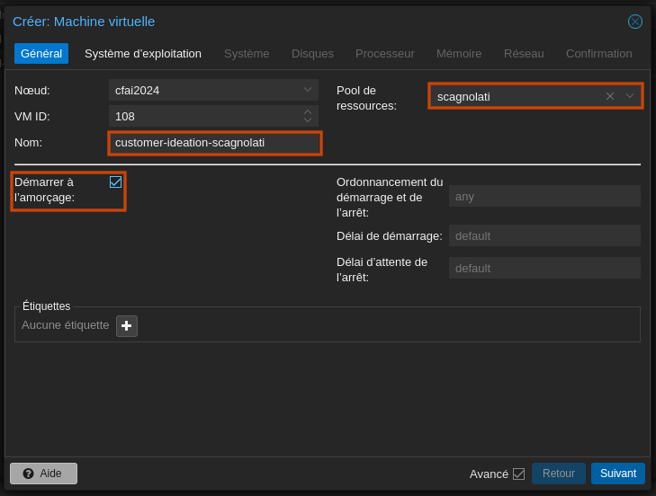
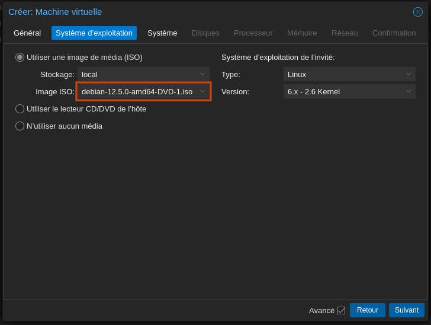
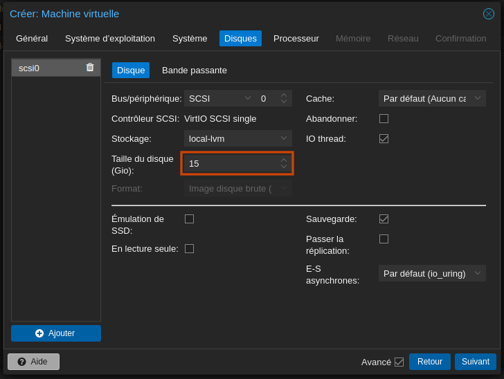
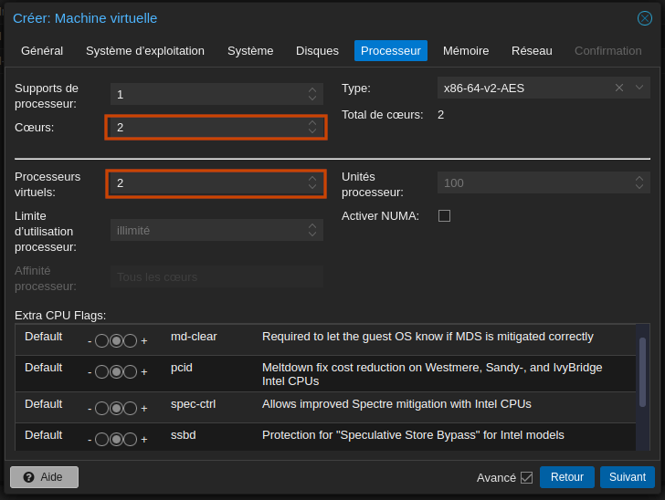
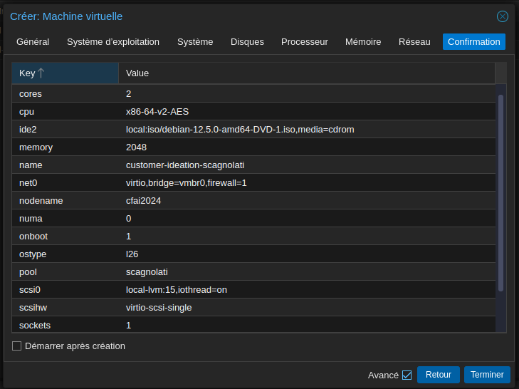

# Création de la machine virtuelle

## Paramétrage de la machine virtuelle

La machine virtuelle que je devais créer comportait les caractéristiques suivantes :
- **Name**: customer-ideation-scagnolati
- **Ressource Pool**: scagnolati
- **Start at boot** : yes
- **ISO** : Debian (latest)
- **Disk Size** : 15Go
- **VCPU** : 2
- **RAM** : 2Go
- **Network** : 1 interface

1. Choix du nom, du pool de ressource et du démarrage.

2. Choix du système d'exploitation.

3. Choix de la taille du disque.

4. Choix du nombre de vCPU.

5. Confirmation et création de la machine virtuelle.

