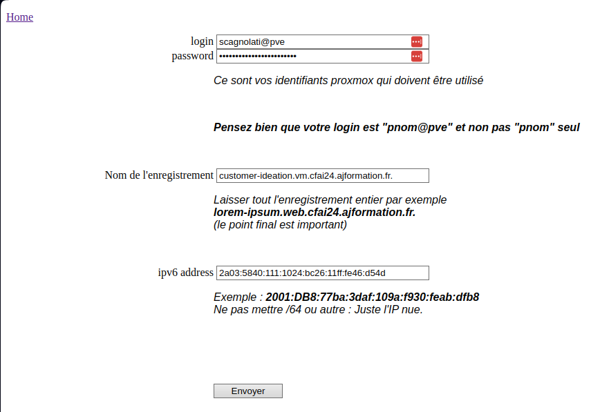
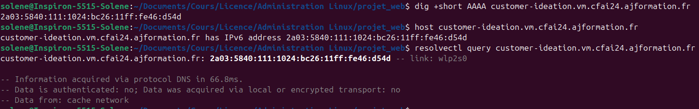
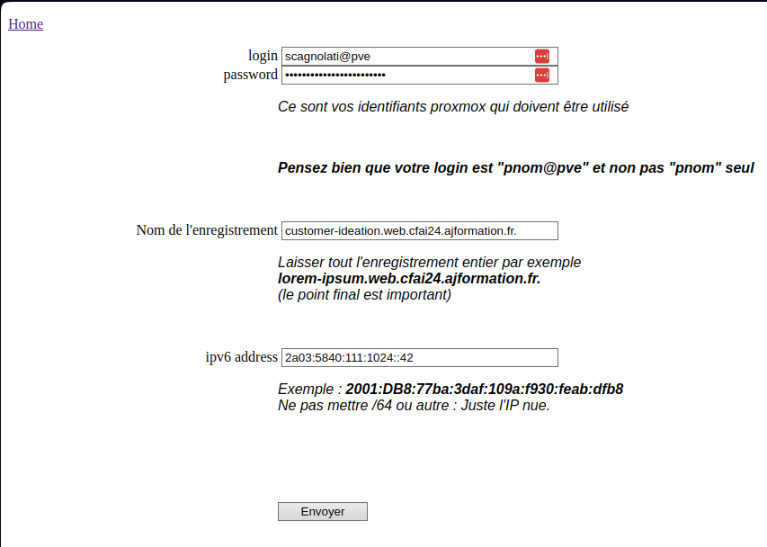
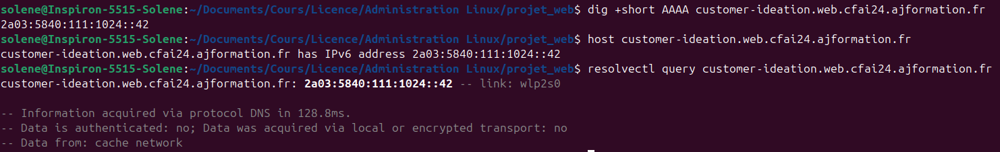
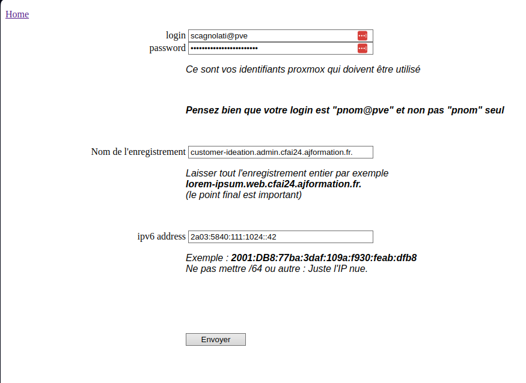
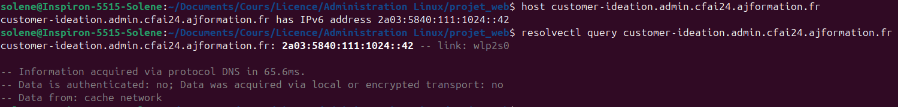

# Enregistrement des FQDN

## Enregistrement du FQDN pour l'accès SSH

- Le FQDN est **customer-ideation.vm.cfai24.ajformation.fr** pour l'adresse IPv6 SLAAC **2a03:5840:111:1024:bc26:11ff:fe46:d54d**



```
# On vérifie l'enregistrement
dig +short AAAA customer-ideation.vm.cfai24.ajformation.fr
host customer-ideation.vm.cfai24.ajformation.fr
resolvectl query customer-ideation.vm.cfai24.ajformation.fr
```



## Enregistrement du FQDN pour le site vitrine

- Le FQDN est **customer-ideation.web.cfai24.ajformation.fr** pour l'adresse IPv6 **2a03:5840:111:1024::42**



```
# On vérifie l'enregistrement
dig +short AAAA customer-ideation.web.cfai24.ajformation.fr
host customer-ideation.web.cfai24.ajformation.fr
resolvectl query customer-ideation.web.cfai24.ajformation.fr
```



## Enregistrement du FQDN pour le site gestion

- Le FQDN est **customer-ideation.admin.cfai24.ajformation.fr** pour l'adresse IPv6 **2a03:5840:111:1024::42**



```
# On vérifie l'enregistrement
dig +short AAAA customer-ideation.admin.cfai24.ajformation.fr
host customer-ideation.admin.cfai24.ajformation.fr
resolvectl query customer-ideation.admin.cfai24.ajformation.fr
```

