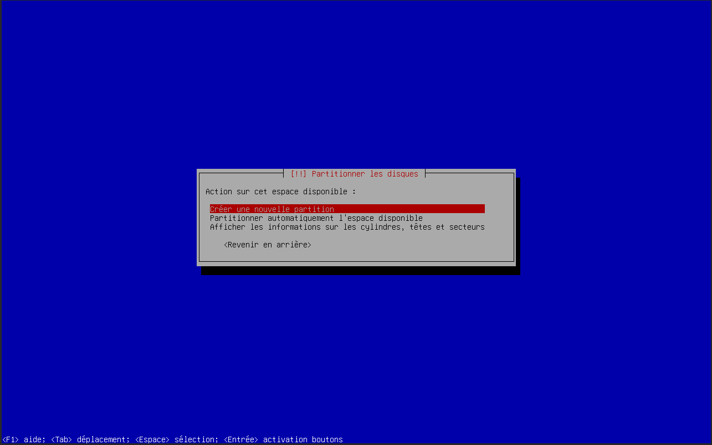
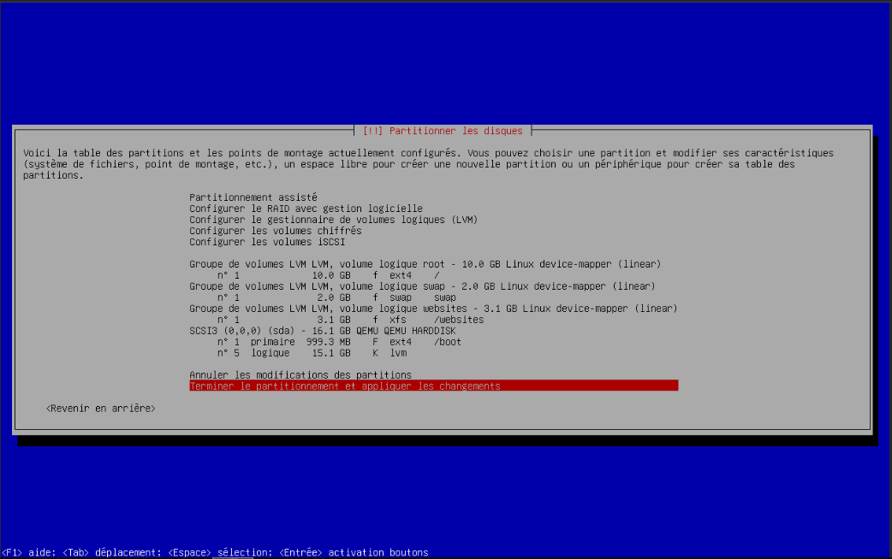

# Installation du système d'exploiration

1. Configuration des locales

2. Configuration de la machine

3. Configuration des utilisateurs principaux

4. Partitionnement et formatage du disque

Le partitionnement de la machine virtuelle devait être le suivant :
- Partition primaire **boot**
    - 1GB
    - EXT4
    - Montée sur /boot 
- Partition LVM **root**
    - 10GB
    - EXT4
    - Montée sur /
- Partiton LVM **swap**
    - 2GB
    - SWAP
    - Montée sur swap
- Partition LVM **websites**
    - Tout le reste (3GB)
    - XFS
    - Montée sur /websites

5. Installation des logiciels essentiels

