# Installation des paquets et outils

- Les paquets attendus sont :
    - PHP
    - Nginx
    - MySQL
    - SNMP Serveur
    - GCC
    - Make
- Les outils attendus sont :
    - Jekyll pour le site **vitrine**
    - YetiForce pour le site **gestion**

## Installation des paquets

```
# On met à jour les dépôts
apt update
```

- Installation de PHP
```
apt install -y php php-fpm php-mysql

# On vérifie que l'installation s'est bien déroulée
php -v
dpkg -l | grep php
```

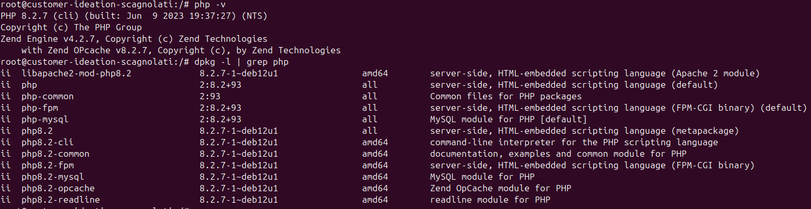


- Installation de Nginx
```
apt install -y nginx

# On vérifie que l'installation s'est bien déroulée
dpkg -l | grep nginx
```

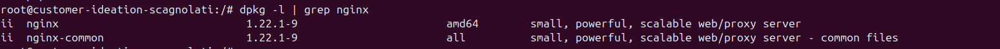

```
# Si la machine a déjà apache2 d'installé, il faut le désactiver
systemctl stop apache2
systemctl disable apache2

# On active le service nginx
systemctl enable nginx
systemctl start nginx

# On vérifie que le service a bien démarré
systemctl status nginx
```

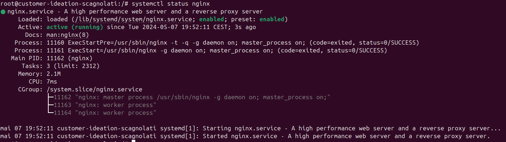

- Installation de MySQL
```
# MySQL n'étant plus disponible dans les dépôts Debian, on les met à jour
apt install -y wget

# On installe la version 8.0 de MySQL (Compatible YetiForce) 
wget https://dev.mysql.com/get/mysql-apt-config_0.8.30-1_all.deb
apt install -y ./mysql-apt-config_*_all.deb
```

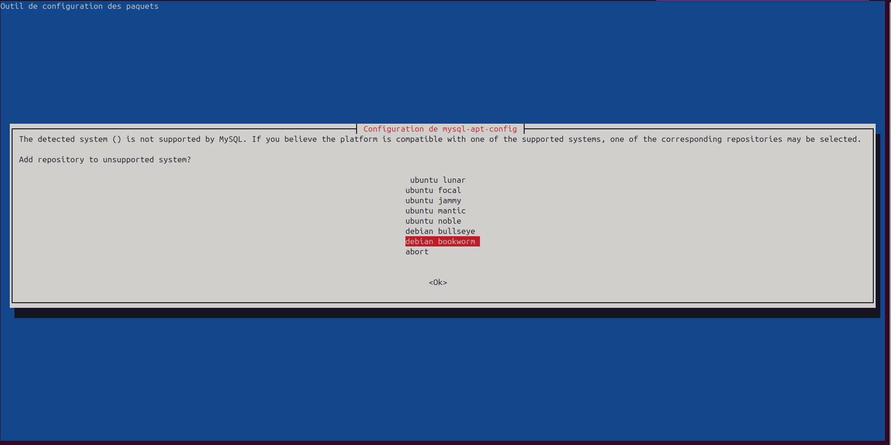
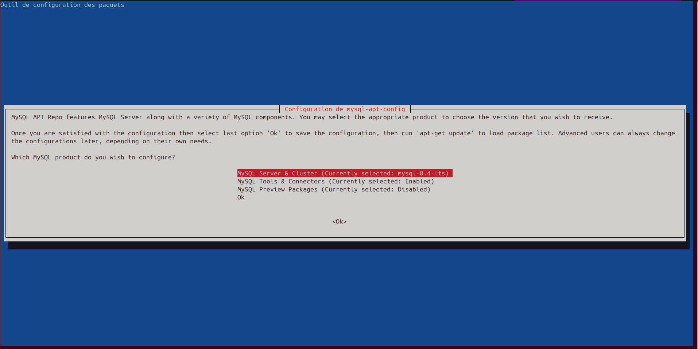
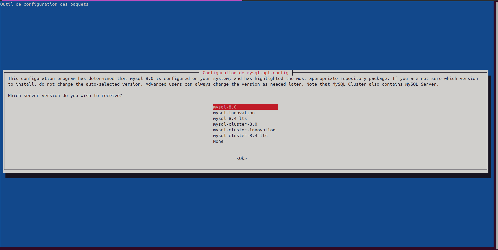
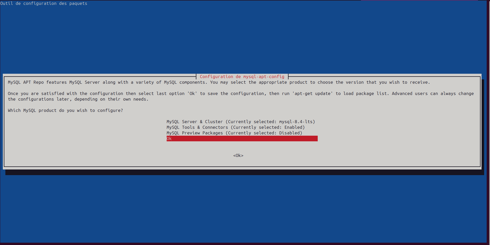

```
# On termine la configuration des dépôts
apt update

# On installe le paquet
apt install -y mysql-server

# On vérifie que l'installation s'est bien déroulée
mysql --version
```

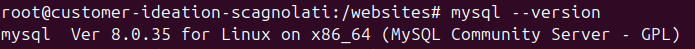

```
# On active le service mysql
systemctl enable mysql
systemctl start mysql

# On vérifie que le service a bien démarré
systemctl status mysql
```

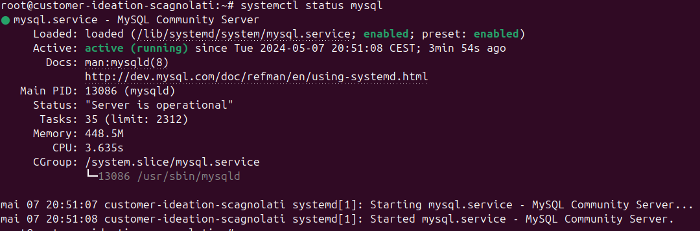

```
# On sécurise l'installation
mysql_secure_installation
```

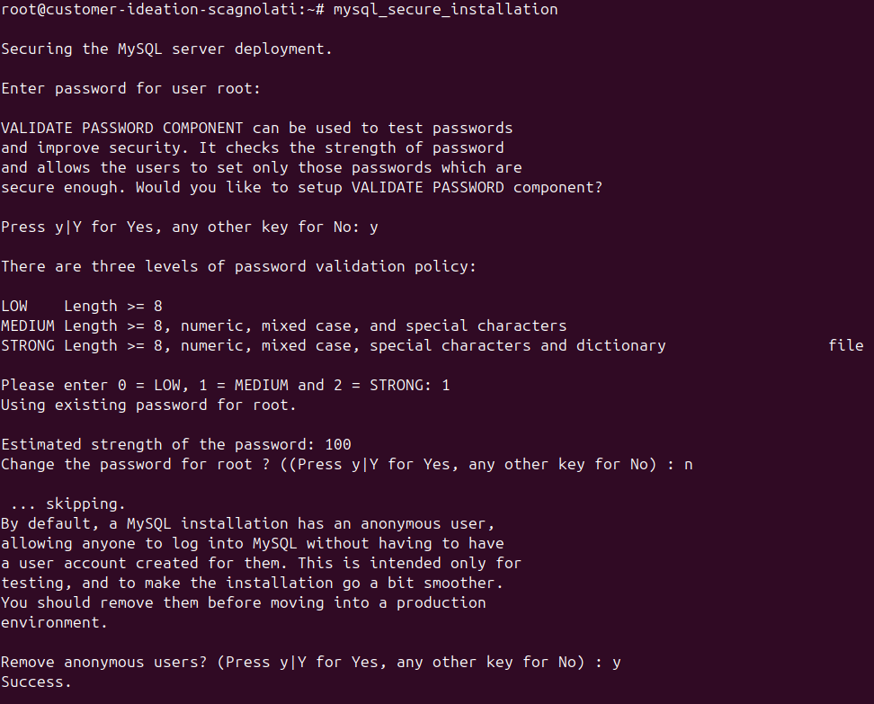
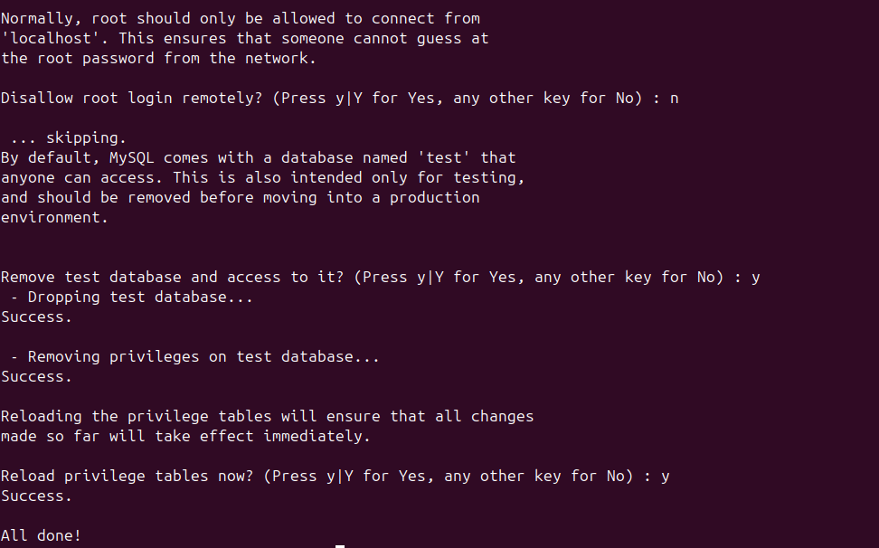

- Installation de SNMP Serveur
```
apt install -y snmpd

# On vérifie que l'installation s'est bien déroulée
snmpd -v
```

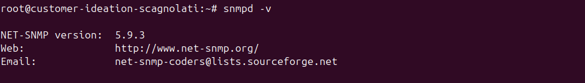

```
# On active le service snmpd
systemctl enable snmpd
systemctl start snmpd

# On vérifie que le service a bien démarré
systemctl status snmpd
```

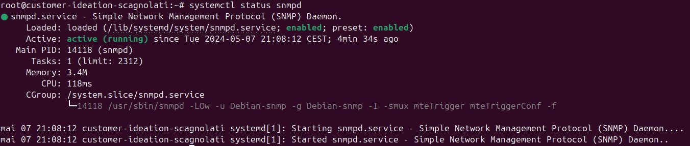

- Installation de GCC
```
apt install -y gcc

# On vérifie que l'installation s'est bien déroulée
gcc -v
```

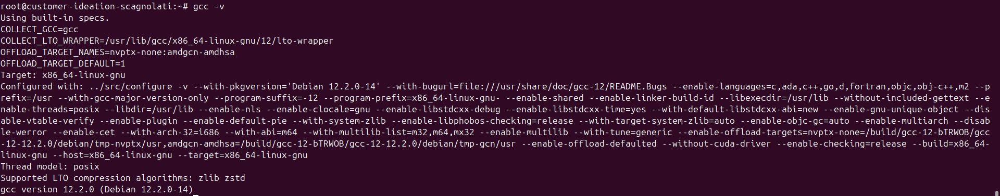

- Installation de Make
```
apt install -y make

# On vérifie que l'installation s'est bien déroulée
make -v
```

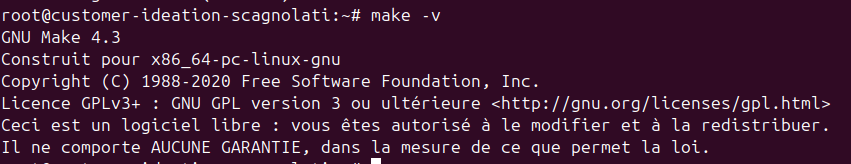

## Installation des outils

### Installation de Jekyll pour le site vitrine

Pour fonctionner, Jekyll nécessite :

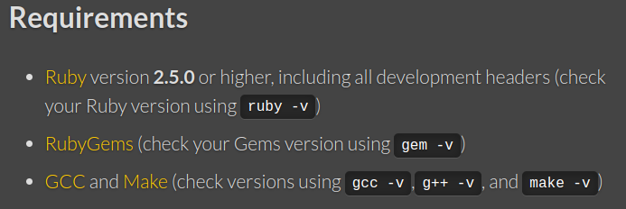

```
# Installation de Ruby
apt install libc6=2.36-9+deb12u4
apt -y install ruby-full build-essential

# On vérifie que l'installation s'est bien déroulée
ruby -v
gem -v
```

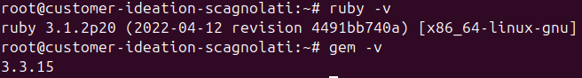

```
# Installation de gems
su - webmaster
echo '# Install Ruby Gems to ~/gems' >> ~/.bashrc
echo 'export GEM_HOME="$HOME/gems"' >> ~/.bashrc
echo 'export PATH="$HOME/gems/bin:$PATH"' >> ~/.bashrc
source ~/.bashrc

# Installation du bundle Jekyll
gem install jekyll bundler

# Création du site vitrine
jekyll new .

# Attribution des droits et propriétés
chmod -R 775 /websites/vitrine
chown -R webmaster:vitrine /websites/vitrine
```

### Installation de YetiForce pour le site gestion

- On commence par installer les dépendances nécessaires
```
apt install php8.2-curl php8.2-gd php8.2-intl php8.2-mbstring php8.2-mysql php8.2-zip php8.2-imap php8.2-xml php8.2-dom php8.2-soap php8.2-simplexml php8.2-bcmath
apt install curl composer
```

- On télécharge le fichier d'installation complète de YetiForce 7.0.0

```
# Transfert du fichier vers la machine virtuelle
scp 7.0.0-complete.zip webmaster@[2a03:5840:111:1024:bc26:11ff:fe46:d54d]:/home/webmaster/.

# Installation du fichier
su - webmaster
mv YetiForceCRM.zip /websites/gestion/.
cd /websites/gestion/
unzip YetiForceCRM.zip
rm YetiForceCRM.zip

# Attribution des droits et des propriétés
chmod -R 775 /websites/gestion
chown -R webmaster:gestion /websites/gestion
```