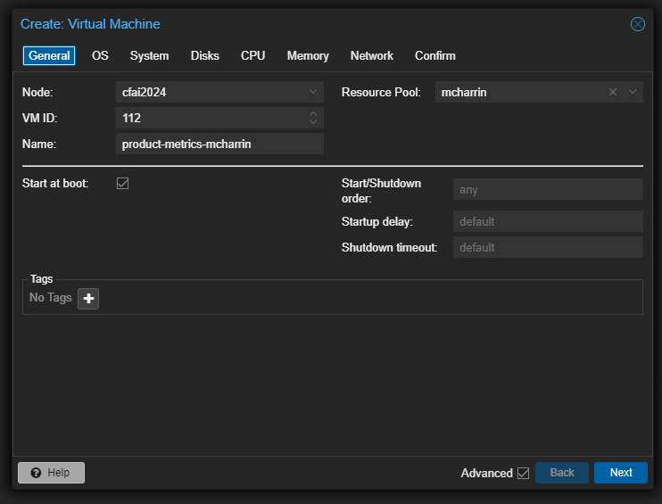
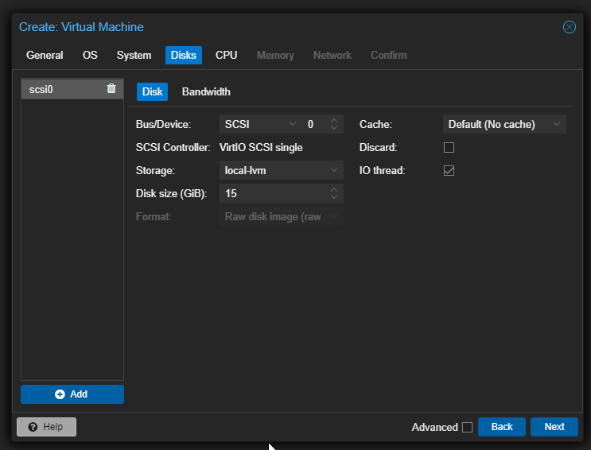
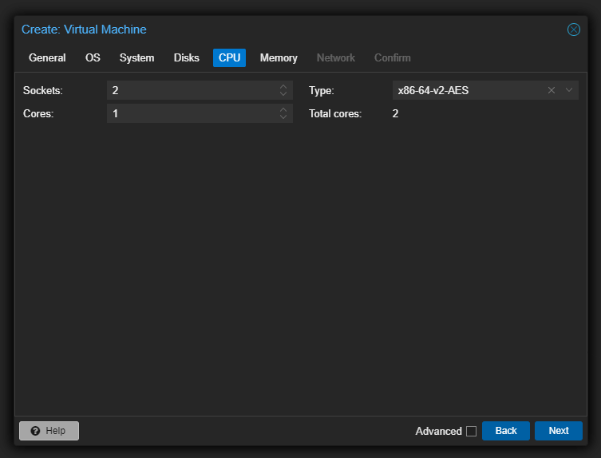
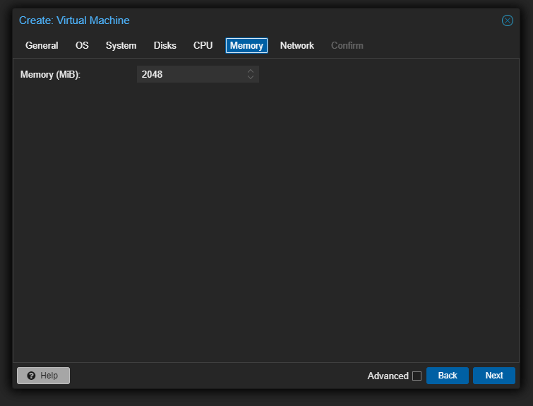
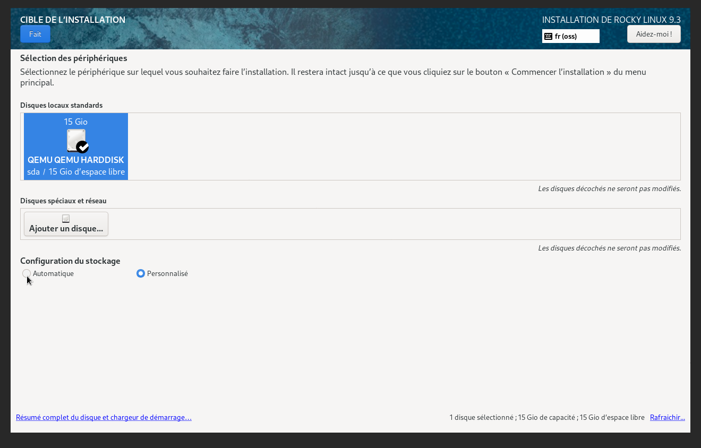
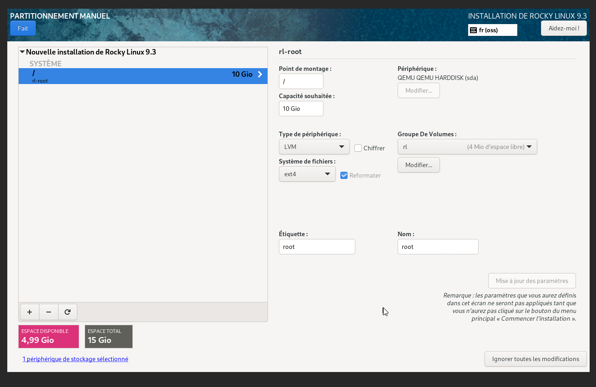
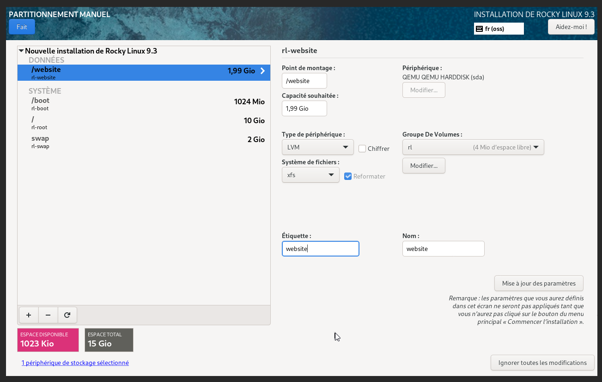
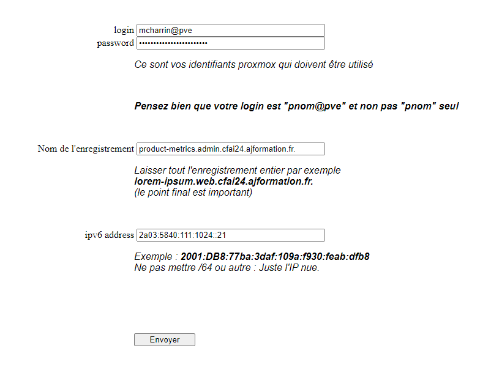

# Identité : Mattéo Charrin 

--- 

##  1) Création d'une VM RockyLinux *Temps : 10min*


Une fois connecté à Proxmox, cliquez en haut à droite sur "Create VM", puis configurez-la avec les paramètres demandés précédemment.






## 2) Partitionnement de la VM *Temps :  25min* 

Une fois la VM lancer une choisis la langue de la machine. Ici le Français puis on arrive sur l'interface de configuration  


En bas a droit on va crée un mot de passe **root** et crée un utilisateur (voir administration.yaml)

Puis passer aux partitionnement du disque 
On clique sur 'Installation Destination' puis on choisis notre disque et on coche la case 'Personnalisé' pour la configuration du stockage. 



Une nouvelle fenêtre va s'afficher en nous demandant de crée notre premier partition 
Exemple pour la partition : 1 partition lvm taille 10GB de type ext4 montée sur / et labellisé root


Une fois les 4 partitions montée : 

Pour finaliser on clique sur fait en haut a gauche et on accepte les modifications. 

Une fois toutes les config réaliser on clique sur "Commencer l'installation" en bas a droite de la fenêtre

## 3) Mise en réseau de la VM 20min

Pour commencer on va aller chercher les infos pour savoir le nom de la carte reseau et l'adresse IPV6 deja utiliser par SLAA 

```shell
ip a
```

Une fois la commande réaliser on peut trouver comme info : 
- Nom de la carte : ens18 
- adresse ipv6 2a03:5840:111:1024:be24:11ff:fe83:9395/64 

Maintenant on peut ajouter une nouvelle adresse ip avec la commande 
```shell 
sudo nmcli con mod ens18 ipv6.addresses '2a03:5840:111:1024:be24:11ff:fe83:9395/64, 2a03:5840:111:1024::21/64 '
```
Puis cette commande afin d'activer la connexion : 
```shell 
sudo nmcli con up ens18
```
## 4) Création des Groupes et affectation au dossier 30min 

On va avoir besoin de Nginx pour faire les groupes donc on va directement installer le paquet 
```shell 
sudo dnf install nginx
```


On commence par crée les différents groupes avec ces commandes 

```shell 
sudo groupadd cplr
sudo groupadd vitrine
sudo groupadd gestion
```

Ensuite on va crée les utilisateurs et gérer leurs mot de passe 
```shell
sudo adduser webmaster
sudo adduser cchampagne
sudo adduser bcramer
---
sudo passwd webmaster
sudo passwd cchampagne
sudo passwd bcramer
```

Puis ajouter les différent utilisateurs a leur groupes :
```shell
sudo usermod -aG vitrine webmaster
sudo usermod -aG vitrine mcharrin
sudo usermod -aG vitrine cchampagne
---
sudo usermod -aG gestion webmaster
sudo usermod -aG gestion mcharrin
sudo usermod -aG gestion bcramer
```

Ensuite on crée les différents sous-dossier de website
```shell
sudo mkdir -p /website/vitrine /website/gestion
```

Et on viens ajouter les propriétaires et groupes a ces dossier 
```shell
sudo chown nginx:cplr /website
sudo chown webmaster:vitrine /website/vitrine
sudo chown webmaster:gestion /website/gestion
```

puis on corrige les droit avec chmod 

```shell 
chmod 775 /website
chmod 775 /website/vitrine
chmod 775 /website/gestion
```


## 5) Enregistrement DNS 1h30

On suit les instruction disposer sur le site :  http://ns1.cfai2024.ajformation.fr:5000/



On fait sa pour les 3 Nom / Ipv6 : 
- [product-metrics.vm.cfai24.ajformation.fr](http://product-metrics.vm.cfai24.ajformation.fr/)
- [http://product-metrics.web.cfai24.ajformation.fr](http://product-metrics.web.cfai24.ajformation.fr/)
- [http://product-metrics.admin.cfai24.ajformation.fr](http://product-metrics.admin.cfai24.ajformation.fr/)

## 6) Ajout des différentes outils demander 

### Install des outils de développement pour Rocky Linux 

```shell 
sudo dnf groupinstall "Development Tools" "RPM Development Tools"
```

### On va aussi installer SSH 

```shell
sudo dnf install openssh-server
```

### SNMP serveur 

```shell
sudo dnf install net-snmp net-snmp-utils`
```

### Mysql 

```shell
sudo dnf install mysql-server
```

### PHP 
```shell 
sudo dnf install php php-cli php-common php-mysqlnd
```

Et on fini par lancer toutes les outils 

```shell 
systemctl start sshd
systemctl start snmpd
systemctl start mysqld
systemctl start nginx
```

## 7) Configuration de Nginx 4h 

On se rend dans le fichier de conf de nginx 
```shell 
sudo nano /etc/nginx/nginx.conf
```

```nginx
server {
    listen [::]:80;
    server_name product-metrics.web.cfai24.ajformation.fr;
   

    location / {
        proxy_pass http://[2a03:5840:111:1024::21]/wbesite/vitrine;
        proxy_set_header Host $host;
        proxy_set_header X-Real-IP $remote_addr;
        proxy_set_header X-Forwarded-For $proxy_add_x_forwarded_for;
        proxy_set_header X-Forwarded-Proto $scheme;
    }
}
server{
    listen [::]:80;
    server_name product-metrics.admin.cfai24.ajformation.fr;
    location / {
        proxy_pass http://[2a03:5840:111:1024::21]/website/gestion;
        proxy_set_header Host $host;
        proxy_set_header X-Real-IP $remote_addr;
        proxy_set_header X-Forwarded-For $proxy_add_x_forwarded_for;
        proxy_set_header X-Forwarded-Proto $scheme;
    }
}
```

Puis on ouvre le port 80 pour le http

```shell
sudo firewall-cmd --permanent --add-port=80/tcp
```

