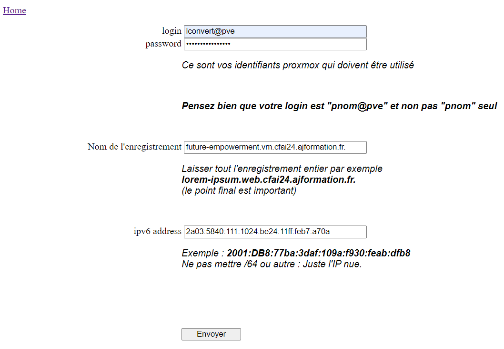
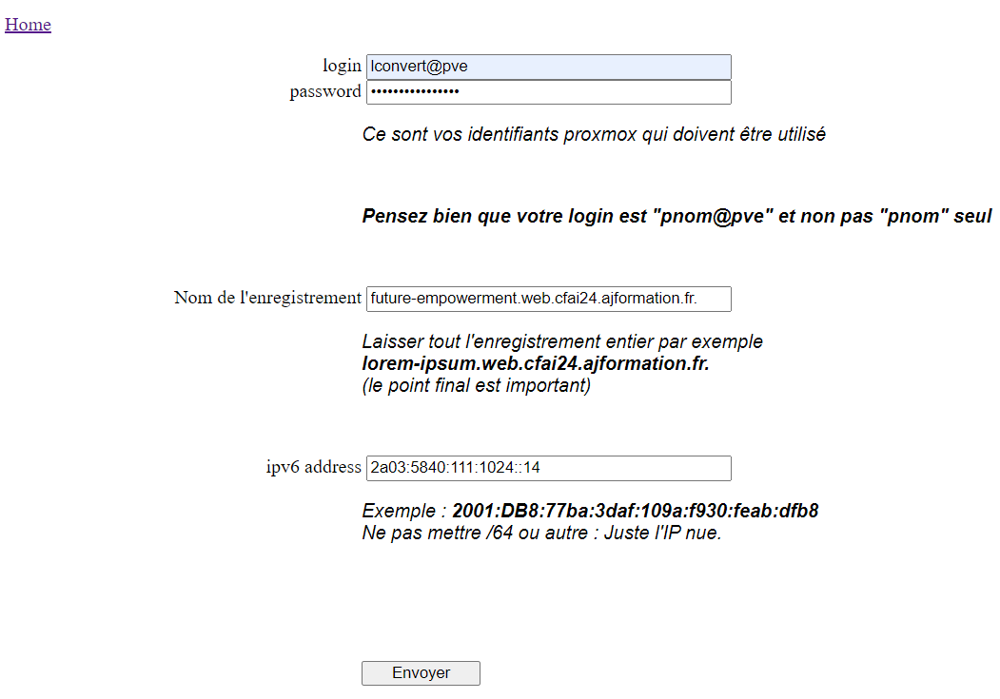
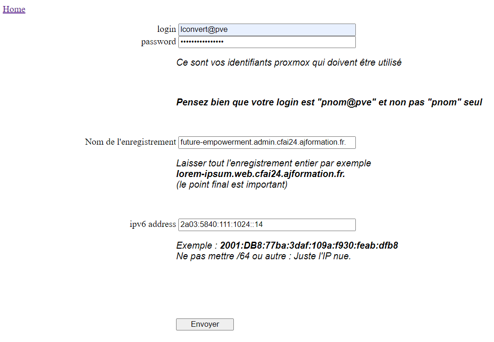
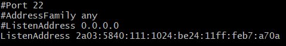
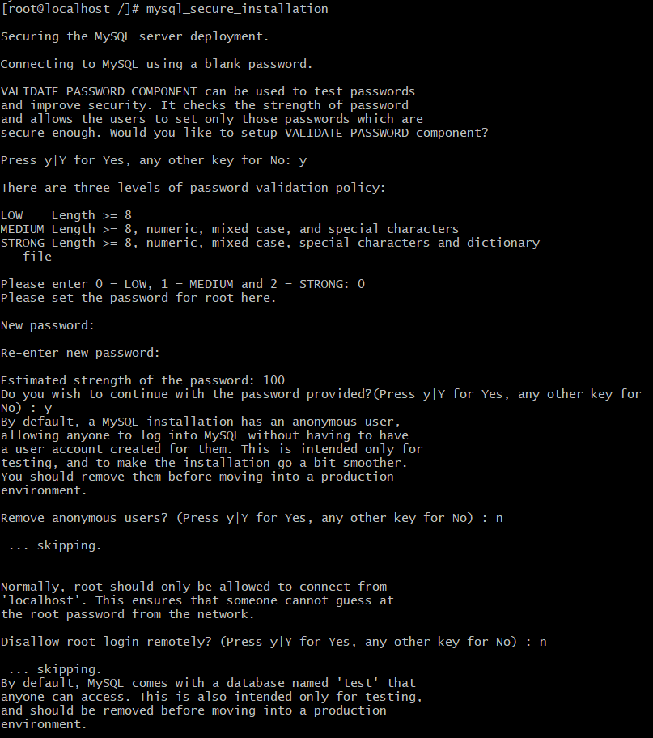
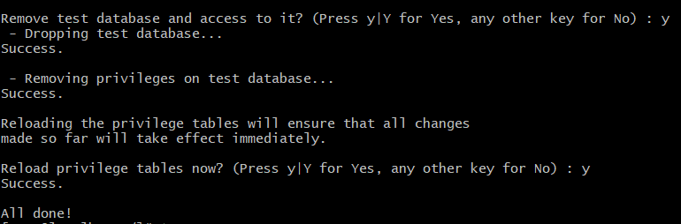
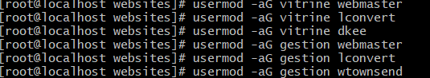
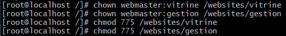
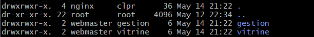

# Auteur : Loic CONVERT

# Journal d'activités

# Création de la VM
 Temps de réalisation : 45 min

 Travaux réalisés:
 1. Création de la VM
 2. Partionnement de la VM et création des utilisateurs root et lconvert
 3. Update des packages avec la commande : sudo dnf update && sudo dnf upgrade -y

# Configuration et Activation de l'IPv6 

 Temps de réalisation : 30 min

Travaux réalisés: 
Ajout d'une adresse IPv6 : sudo nmcli con mod ens18 ipv6.addresses "2a03:5840:111:1024:be24:11ff:feb7:a70a/64, 2a03:5840:111:1024::14/64"
Activer la connexion réseau pour l'interface ens18 : sudo nmcli con up ens18
* [Commit](https://github.com/CFAI2024-CPLR/projet_web/commit/938e04950e76f29dce3ad9c8b8e49c6c914a3540)

# Enregistrement dans le DNS les FQDN
 Temps de réalisation : 30 min

Travaux réalisés: Enregistrement des FQDN

| Domaine                                             | Adresse IPv6                                 |
|-----------------------------------------------------|----------------------------------------------|
| future-empowerment.vm.cfai24.ajformation.fr         | 2a03:5840:111:1024:be24:11ff:feb7:a70a       |
| future-empowerment.web.cfai24.ajformation.fr        | 2a03:5840:111:1024::14                       |
| future-empowerment.admin.cfai24.ajformation.fr      | 2a03:5840:111:1024::14                       |

# Installation et Configuration des logiciels
Temps de réalisation: 1 h

Travaux réalisés:

Pour installer tous les paquets nécessaires, j'ai executé la commande suivante : sudo dnf install -y openssh-server gcc make net-snmp nginx mysql php php-fpm php-mysqlnd

Fichier de configuration Nginx :
* [Configuration](Configuration/nginx.conf)

Fichier de configuration PHP :
* [Configuration](Configuration/php.ini)

Fichier de configuration SSH : 
* [Configuration](Configuration/sshd_config)

Fichier de configuration du Serveur Mysql :
* [Configuration](Configuration/mysql-server.cnf)# Auteur : Loic CONVERT

# Journal d'activités

# Création de la VM
 Temps de réalisation : 45 min

 Travaux réalisés:
 1. Création de la VM
 2. Partionnement de la VM et création des utilisateurs root et lconvert
 3. Update des packages avec la commande : sudo dnf update && sudo dnf upgrade -y

# Configuration et Activation de l'IPv6 

 Temps de réalisation : 30 min

Travaux réalisés: 
Ajout d'une adresse IPv6 : sudo nmcli con mod ens18 ipv6.addresses "2a03:5840:111:1024:be24:11ff:feb7:a70a/64, 2a03:5840:111:1024::14/64"
Activer la connexion réseau pour l'interface ens18 : sudo nmcli con up ens18
* [Commit](https://github.com/CFAI2024-CPLR/projet_web/commit/938e04950e76f29dce3ad9c8b8e49c6c914a3540)

# Enregistrement dans le DNS les FQDN
 Temps de réalisation : 30 min

Travaux réalisés: Enregistrement des FQDN

| Domaine                                             | Adresse IPv6                                 |
|-----------------------------------------------------|----------------------------------------------|
| future-empowerment.vm.cfai24.ajformation.fr         | 2a03:5840:111:1024:be24:11ff:feb7:a70a       |
| future-empowerment.web.cfai24.ajformation.fr        | 2a03:5840:111:1024::14                       |
| future-empowerment.admin.cfai24.ajformation.fr      | 2a03:5840:111:1024::14                       |

# Installation et Configuration des logiciels
Temps de réalisation: 1 h

Travaux réalisés:

Pour installer tous les paquets nécessaires, j'ai executé la commande suivante : sudo dnf install -y openssh-server gcc make net-snmp nginx mysql php php-fpm php-mysqlnd

Fichier de configuration Nginx :
* [Configuration](Configuration/nginx.conf)

Fichier de configuration PHP :
* [Configuration](Configuration/php.ini)
  
-Configuration ssh :

Autorisation de la connexion SSH uniquement depuis l'adresse IPv6 :

Fichier de configuration SSH : 
* [Configuration](Configuration/sshd_config)

Fichier de configuration du Serveur Mysql :
* [Configuration](Configuration/mysql-server.cnf)

Après avoir executé la commande suivante : dnf install -y mysql-server, nous devons démarrer le service --> systemctl start mysqld
Maintenant, pour sécuriser l'installation de MySQL, utiliser cette commande : mysql_secure_installation

# Création des groupes et des utilisateurs : 
Temps de réalisation: 1h

Travaux réalisés:

Création du groupe clpr
Création du groupe vitrine
Création du groupe gestion

Executer la commande suivante pour chaque groupes : sudo groupadd "groupe"
Assuré vous de remplacer "groupe" par le nom du groupe souhaité.

Création du compte webmaster
Création du compte dkee
Création du compte wtownsend
Executer la commande suivante pour chaque utilisateurs : sudo useradd -mU utilisateur -c "utilisateur"
Assuré vous de remplacer "utilisateur" par le nom d'utilisateur souhaité.

Ensuite, pour ajouter les utilisateurs aux groupes correspondant : 

Bien pensez a donner les droits avec cette commande : 

Pour afficher les droits : 

