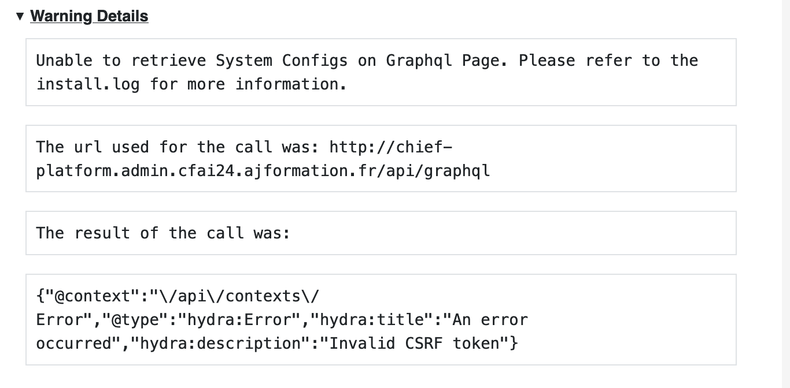

# Identité

* Nom : EXTRAT
* Prénom : Florence

# Journal d'activité

## Mise en place de la machine virtuelle

* Temps de réalisation : 35 minutes
* Travaux :
    - Configuration physique de la machine
    - Installation de l'OS Rocky Linux 9.3
    - Partitionnement et formattage de la machine

## Configuration réseau IPv6
* Temps de réalisation : 15 minutes
* Travaux :
    - récupération de l'IP SLAAC
    - Test de la seconde IPv6 avec **nmap**
    - Ajout de la seconde IPv6 à la carte réseau
    - Redémarrage du service réseau

## Configuration du serveur SSH
* Temps de réalisation : 15 minutes
* Travaux : 
    - Installation du serveur SSH avec : ```bash dnf install openssl-server```
    - Configuration SSH : [Commit de la configuration SSH](https://github.com/CFAI2024-CPLR/projet_web/commit/cd0113d161b13c601ffe34469f758456fede8d4a)

## Configuration des enregistrements DNS
* Temps de réalisation : 25 minutes
* Travaux :
    - Enregistrement des FQDN dans le DNS
    - Vérification avec la commande **host**

|FQDN| IP|
| :---: | :---: |
|chief-platform.vm.cfai24.ajformation.fr.|2a03:5840:111:1024:be24:11ff:feb9:5e8b|
|chief-platform.web.cfai24.ajformation.fr.|2a03:5840:111:1024::11|
|chief-platform.admin.cfai24.ajformation.fr.|2a03:5840:111:1024::11|

## Création et configuration des utilisateurs et groupes
* Temps de réalisation : 10 minutes
* Travaux : 
    - Création des groupes
    - Création des utilisateurs
    - Affilier les utilisateurs aux groupes correspondants

## Installation des logiciels et services
* Temps de réalisation : 45 minutes
* Travaux réalisés :
    - Installation des paquets suivant avec la commande : ```bash dnf install gcc make net-snmp net-snmp-utils httpd mysql mysql-server```
        - **gcc** : compilateur GNU
        - **make** : utilitaire de build
        - **net-snmp** et **net-snmp-utils** : service SNMP
        - **httpd** : apache
        - **mysql** : client MySQL
        - **mysql-server** : serveur MySQL
    - Installation de PHP 8.1 :
    ```bash
    dnf install epel-release
    dnf install http://rpms.remirepo.net/enterprise/remi-release-9.rpm
    dnf install dnf-utils
    dnf module reset php
    dnf module install php:remi-8.1

    Dnf install php php-cli php-common php-gd php-mbstring php-json php-xml php-mysqlnd php-zip php-intl php-soap php-ldap php-bcmath php-imap
    ```
    - Autorisation de pare feu

* Difficultés rencontrées :
    - Il a fallu chercher comment installer une version de php supérieure à la 8.0 dans le but d'utiliser le CRM Vtiger par la suite.
    - Modifier les règles de pare-feu.

## Configuration des droits des dossiers
* Temps de réalisation : 10 minutes
* Travaux effectués :
    - Accorder les droits adaptés aux dossiers **/websites**, **/websites/vitrine**, **websites/gestion**

## Configuration globale Apache2
* Temps de réalisation : 45 minutes
* Travaux effectués :
    - Dans le fichier de configuration [httpd.conf](https://github.com/CFAI2024-CPLR/projet_web/commit/0097419181de5f40d45e3f0f48df41ad11c63cca)
        - Ecouter sur l'adresse IP fixe
        - Renseigner l'utilisateur et le groupe dédié pour exécuter httpd
    - Changer les droits de [php-fpm](https://github.com/CFAI2024-CPLR/projet_web/commit/f45c9f0ea221e4d6ce7f4f9c3d0c4f34e51e8cb6)
        - ```bash
            listen.owner = webmaster
            listen.group = clpr
            listen.mode = 0660
        - Commenter la ligne concernant les acl
* Difficultés rencontrées :
    - Comprendre comment configurer Apache2. C'était une première et a nécessité du temps et de l'aide.
    - Comprendre pourquoi les acl étaient problématiques.

## Mise en place des sites
### Site de gestion : SuiteCRM
* Temps de réalisation : 4h
* Travaux effectués :
    - Installation du [site de gestion](http://chief-platform.admin.cfai24.ajformation.fr/)
    - Création de la base de données
    - [Configuration du site de gestion](https://github.com/CFAI2024-CPLR/projet_web/commit/40153603efc7cc78ddb30d080d765ef54082cc27)
* Obstacles rencontrés :
    - Absence de fichier de configuration config.php car le fichier est généré lors de l'installation.
    - l'API graphQL est inaccessible à cause d'un token invalide
    
#### Tentative de résolution :
- Création d'un fichier config.php contenant les lignes suivantes :
```bash
'host_name' => 'chief-platform.admin.cfai24.ajformation.fr',
'site_url' => 'http://chief-platform.admin.cfai24.ajformation.fr',
```
- Ajout des règles suivantes dans le fichier gestion.conf :
```bash
Header set Access-Control-Allow-Origin "*"
Header set Access-Control-Allow-Methods "GET, POST, OPTIONS, DELETE, PUT"
Header set Access-Control-Allow-Headers "Content-Type, X-Requested-With"
```
- Modification des valeurs suivantes dans le [php.ini](https://github.com/CFAI2024-CPLR/projet_web/commit/74b26344e2237659190fd71477574709a269c8f8) :
```bash
session.use_strict_mode = 1
session.cookie_httponly = 1
session.cookie_secure = 0   ; Mettez à 1 si vous utilisez HTTPS
session.use_cookies = 1
session.use_only_cookies = 1
```
Malgré tout cela, le problème persiste.
[Extrait de logs](https://github.com/CFAI2024-CPLR/projet_web/commit/d320e8ba06856bf6c89a4c1bf1f09af184adb308)

#### Difficultés rencontrées :
- Originellement, c'était le CRM Vtiger qui aurait dû être utilisé mais ce dernier renvoyait une *invalid request*. Après vérification de la version de PHP (Vtiger ne supporte qu'à minima PHP 8.1), vérification des droits, re téléchargement et réinstallation de Vtiger, le problème persistait. Sur conseil du formateur, il a été décidé de tenter avec SuiteCRM.
- Comme mentionné plus haut, même avec SuiteCRM j'ai rencontré des difficultés. Malgré l'aide d'un camarade nous ne sommes pas parvenu à l'installer et le configurer.
- Étant débutante, il m'a été très difficile de me repérer dans cet exercice.

### Site Vitrine : GoHugo
* Temps de réalisation : 1 heure 15 minutes
* Travaux effectués :
    - Installation du [site vitrine](http://chief-platform.web.cfai24.ajformation.fr/)
    - Créer un nouveau site avec la commande : ```bash hugo new site /website/vitrine/```
    - Ajouter un thème :
        - Clôner le répertoire d'un thème (ici Papermod)
        - Éditer le fichier [hugo.toml](https://github.com/CFAI2024-CPLR/projet_web/commit/8897cb2de38541f691753cc5922204c7cf394824)
        - Créer un nouveau post
    - Appliquer les droits : ```bash chown -R webmaster:vitrine /websites/vitrine```
    - Créer le vhost [vitrine.conf](https://github.com/CFAI2024-CPLR/projet_web/commit/7e7411e8b3b3573f549db9fa0eaacbf007334352)
    - Redémarrer le httpd

## Utilisateurs
### Informations utilisateurs
|Utilisateur|Login|Password|
| :---: | :---: | :---: |
|root|root|Chaton6666|
|webmaster|webmaster|Uu1cheir|
|John Gaytan|jgaytan|ouh4Ooc1|
|Jim Frankhouser|jfrankhouser|Joo6ahJo|

### Configuration SSH
#### Fichier de configuration
```bash
Host chief-platform
    HostName chief-platform.vm.cfai24.ajformation.fr
    User jgaytan
```
**Attention** : Il faut penser à adapter l'utilisateur dans le fichier de configuration.

#### Commande de connexion :
```bash
ssh  chief-platform
```
