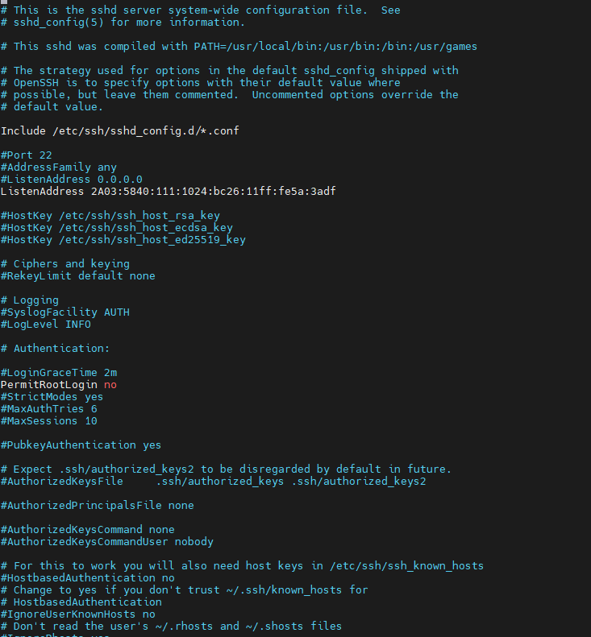
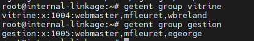

# Dossier FLEURET Mathéo

## Identité
**Nom complet :** FLEURET Mathéo

## Journal des activités

### installation et configuration de la vm
- **Temps de réalisation :** 50 minutes
- **Travaux réalisés :** 
   - configuration de la vm  : 
     Name: internal-linkage-mfleuret
     Ressource Pool: mfleuret
     Start at boot : yes
     ISO : Debian (latest)
     Disk Size : 15Go
     VCPU : 2
     RAM : 2Go
     Network : 1 interface.
   - Installation de Debian : 
     Nom de l'ordinateur : internal-linkage 
     FQDN : internal-linkage.vm.cfai24.ajformation.fr
     - configuration des utilisateur : 
        root : root
        mfleuret : mfleuret
      - partitionnement des disque
      
      - installation des logiciel : 
        uniquement les utilitaire
      
- **Commit :** [Lien du commit](URL_DU_COMMIT)
- **Lien vers le fichier de configuration final :** [Nom du fichier](URL_DU_FICHIER)

### Activité 2 : configuration du reseaux ipv6
- **Temps de réalisation :** 10 min
- **Travaux réalisés :** 
   - Déterminer l'adresse IPv6 SLAAC
  - Choix d'une adresse IPv6 fixe pour les sites web
  - Paramètrage des adresses IPv6 fixes
  - Configuration du réseau
   
- **Commit :** [Lien du commit](URL_DU_COMMIT)

### Activité 3 : installation et configuration de ssh 
- **Temps de réalisation :** 30 min
- **Travaux réalisés :** 
  - Interdiction de la connexion en SSH via l'utilisateur root
  - Autorisation de la connexion SSH uniquement depuis l'adresse IPv6 2A03:5840:111:1024:bc26:11ff:fe5a:3adf
  

## Activité 4 : creation des utilisateur et groupe  
- **Temps de réalisation :** 30 min
- **Travaux réalisés :** 

  - Création du groupe clpr
  - Création du groupe vitrine
  - Création du groupe gestion
  

  - Création du compte webmaster
  - Création du compte egeorge
  - Création du compte wbreland
  

  - Attribution des groupes
  
  

  
   
- **Commit :** [Lien du commit](URL_DU_COMMIT)
- **Lien vers le fichier de configuration final :** [Nom du fichier](URL_DU_FICHIER)

## Activité 6 : installation des outils et service
- **Temps de réalisation :** 30 min
- **Travaux réalisés :** 
Installation de PHP
Installation de SNMP Serveur
Installation de GCC
Installation de Make
  
   
- **Commit :** [Lien du commit](URL_DU_COMMIT)
- **Lien vers le fichier de configuration final :** [Nom du fichier](URL_DU_FICHIER)
## Informations utilisateurs

Pour chaque utilisateur, les informations suivantes sont fournies à l'exception de celles de l'utilisateur principal.

**root**
- **Login :** root
- **Mot de passe :** root

**mfleuret**
- **Login :** mfleuret  
- **Mot de passe :** mfleuret

**webmaster**
- **Login :** webmaster  
- **Mot de passe :** webmaster

**wbreland**
- **Login :** wbreland  
- **Mot de passe :** wbreland

**webmaster**
- **Login :** egeorge  
- **Mot de passe :** egeorge