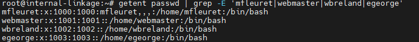

# Dossier FLEURET Mathéo

## Identité
**Nom complet :** FLEURET Mathéo

## Journal des activités

### Activité 1 : installation et configuration de la vm
- **Temps de réalisation :** X heures
- **Travaux réalisés :** 
   - configuration de la vm  : 
     Name: internal-linkage-mfleuret
     Ressource Pool: mfleuret
     Start at boot : yes
     ISO : Debian (latest)
     Disk Size : 15Go
     VCPU : 2
     RAM : 2Go
     Network : 1 interface.
   - Installation de Debian : 
     Nom de l'ordinateur : internal-linkage 
     FQDN : internal-linkage.vm.cfai24.ajformation.fr
     - configuration des utilisateur : 
        root : root
        mfleuret : mfleuret
      - partitionnement des disque
      

- **Commit :** [Lien du commit](URL_DU_COMMIT)
- **Lien vers le fichier de configuration final :** [Nom du fichier](URL_DU_FICHIER)

### Activité 2 : <Titre de l'activité>
- **Temps de réalisation :** X heures
- **Travaux réalisés :** 
   - Description brève des tâches effectuées.
- **Commit :** [Lien du commit](URL_DU_COMMIT)
- **Lien vers le fichier de configuration final :** [Nom du fichier](URL_DU_FICHIER)

## Informations utilisateurs

Pour chaque utilisateur, les informations suivantes sont fournies à l'exception de celles de l'utilisateur principal.

**root**
- **Login :** root
- **Mot de passe :** root

**mfleuret**
- **Login :** mfleuret  
- **Mot de passe :** mfleuret

**Utilisateur root**
- **Login :** root
- **Mot de passe :** rootpassword

## Configuration SSH

```ssh
Host exemple-vm
  HostName exemple-vm.fqdn.com
  User user1
  IdentityFile ~/.ssh/id_rsa_user1
