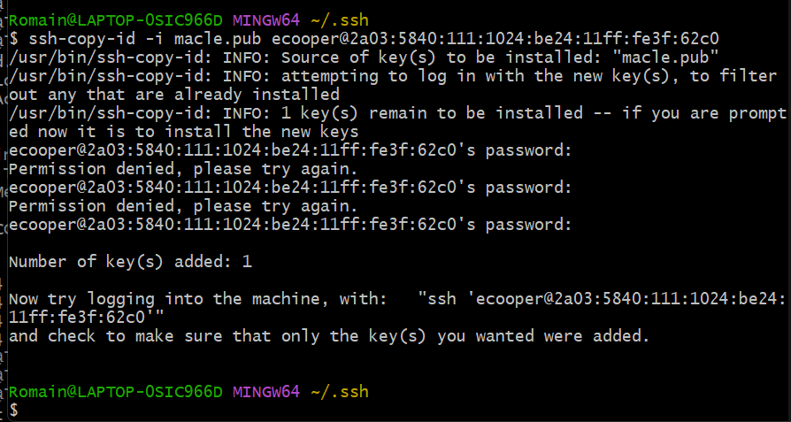

# Création de la machine virtuelle

## Paramétrage de la machine virtuelle

La machine virtuelle que je devais créer comportait les caractéristiques suivantes :
- **Name**: central-scrub-rgagnaire
- **Ressource Pool**: rgagnaire
- **Start at boot** : yes
- **ISO** : Rcocky 
- **Disk Size** : 15Go
- **VCPU** : 2
- **RAM** : 2Go
- **Network** : 1 interface


# Configuration du réseau

1. Déterminer l'adresse IPv6 SLAAC.


2. Choix d'une adresse IPv6 fixe pour les sites web.

 Afin d'éviter les conflits, nous avons décidé de renseigner nos adresses IPv6 fixes dans un document [Administration Linux - IPv6](https://docs.google.com/spreadsheets/d/1V8o3TDtap5S8ppwWNqIwPzmyeoWmFgG2QRDR0904q9Y/edit#gid=0).

la mienne : 2A03:5840:111:1024::13

3. Paramètrage des adresses IPv6 fixes.

- Pour ajouter une autre adresse IPv6 :

sudo nmcli con mod ens18 ipv6.addresses "2a03:5840:111:1024:be24:11ff:fe3f:62c0/64, 2a03:5840:111:1024::13/64"

- On applique ensuite les modifications 

sudo nmcli con up ens18

-On vérifie qu'elles sont prises en compte.


4. On rajoute de le DNS


| FQDN |Adresse IPv6| Utilisation|
| :---: | :---: |  :---: |
|central-scrub.vm.cfai24.ajformation.fr.|  2a03:5840:111:1024:be24:11ff:fe3f:62c0| Accès SSH 
|central-scrub.web.cfai24.ajformation.fr.| 2a03:5840:111:1024::13 | Site web vitrine
| central-scrub.admin.cfai24.ajformation.fr.| 2a03:5840:111:1024::13 | Site web de gestion

5. Configuration du SSH

Autorisation de la connexion SSH uniquement depuis l'adresse IPv6 2A03:5840:111:1024:BC26:11FF:FE46:D54D

- On modifie le fichier /etc/ssh/sshd_config
- On ajoute notre adresse IPv6 à la directive ListenAddress


 On redémarre le service

Création d'une clé SSH pour la connexion :

- On génère une clé SSH 

```
ssh-keygen 
```


- On copie ensuite cette clé sur les tous les users





# Création des utilisateurs et des groupes

1. Utilisateurs 

On ajoute les utilisateurs qu'il faut : 
```
sudo useradd -mU webmaster
sudo useradd -mU mshelton -c "Marian Shelton"
sudo useradd -mU ecooper -c "Evelyn Cooper"
```

On change leurs mot de passe :

```
sudo passwd webmaster
sudo passwd mshelton
sudo passwd ecooper
```


2. Les groupes :

On créer les groupes :

```
addgroup clpr
addgroup vitrine
addgroup gestion
```


