# Création de la machine virtuelle

## Paramétrage de la machine virtuelle

La machine virtuelle demandait les caractéristiques suivantes :

- **Name**: central-scrub-rgagnaire
- **Ressource Pool**: rgagnaire
- **Start at boot** : yes
- **ISO** : Rcocky 
- **Disk Size** : 15Go
- **VCPU** : 2
- **RAM** : 2Go
- **Network** : 1 interface


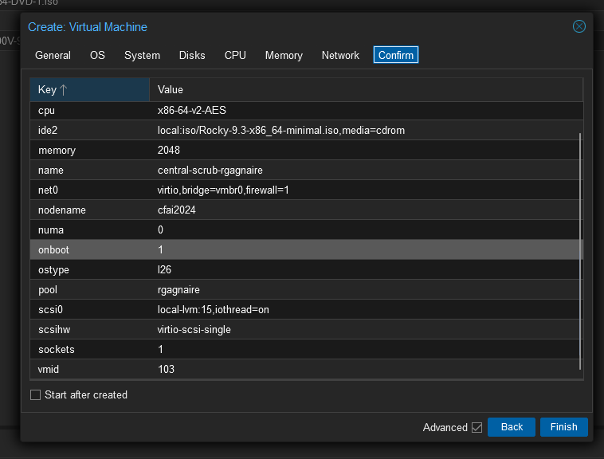

# Configuration du réseau

## Les adresses ipv6

1. Déterminer l'adresse IPv6 SLAAC

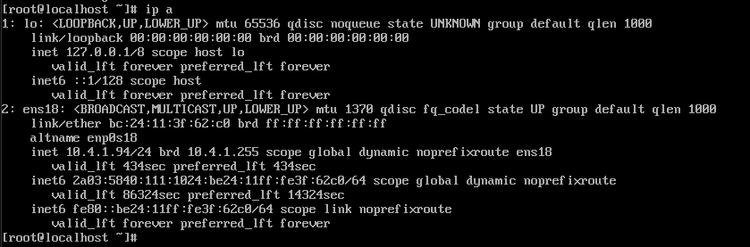


2. Choix d'une adresse IPv6 fixe pour les sites web

Nous avons décidé de renseigner nos adresses IPv6 fixes dans un document [alt text](https://docs.google.com/spreadsheets/d/1V8o3TDtap5S8ppwWNqIwPzmyeoWmFgG2QRDR0904q9Y/edit#gid=0).

- La mienne étant : 2A03:5840:111:1024::13

3. Paramètrage de l'adresse IPv6 fixe

Pour ajouter une autre adresse IPv6 :

```
sudo nmcli con mod ens18 ipv6.addresses "2a03:5840:111:1024:be24:11ff:fe3f:62c0/64, 2a03:5840:111:1024::13/64"
```

On applique ensuite les modifications :

```
sudo nmcli con up ens18
```

On vérifie que notre adresse ipv6 est crée :

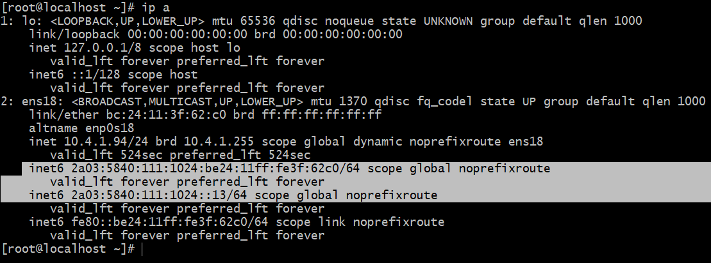

# Le DNS

## Configuration du DNS

1. Ajout du nom de domaine et de son adresse ipv6 correspondante

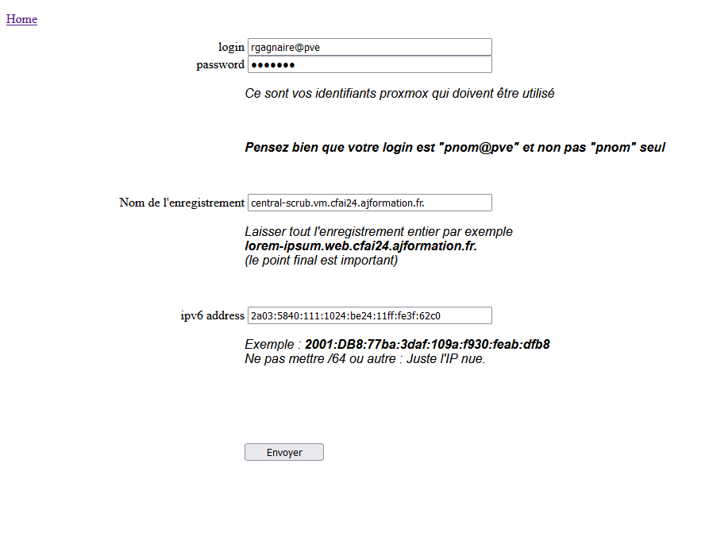

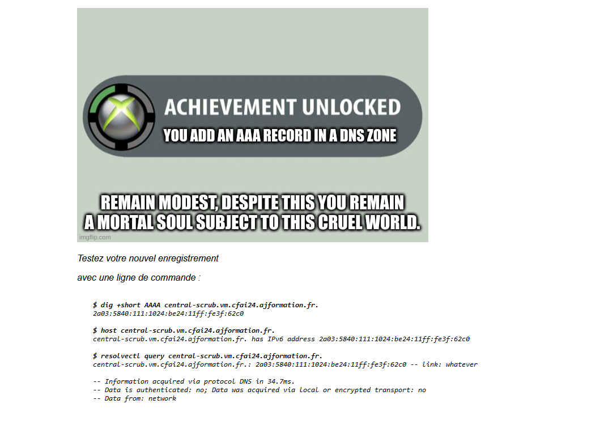

Puis on fait de même pour les autres

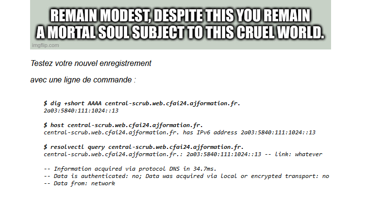


<center>Résumé des nom de domaines affilié aux adresse ipv6 :</center>

| FQDN |Adresse IPv6| Utilisation|
| :---: | :---: |  :---: |
|central-scrub.vm.cfai24.ajformation.fr.|  2a03:5840:111:1024:be24:11ff:fe3f:62c0| Accès SSH 
|central-scrub.web.cfai24.ajformation.fr.| 2a03:5840:111:1024::13 | Site web vitrine
| central-scrub.admin.cfai24.ajformation.fr.| 2a03:5840:111:1024::13 | Site web de gestion

# Le SSH

## Configuration du SSH

1. Autorisation de la connexion depuis notre adresse IPv6 2a03:5840:111:1024:be24:11ff:fe3f:62c0

- On modifie le fichier /etc/ssh/sshd_config
- On ajoute notre adresse IPv6 

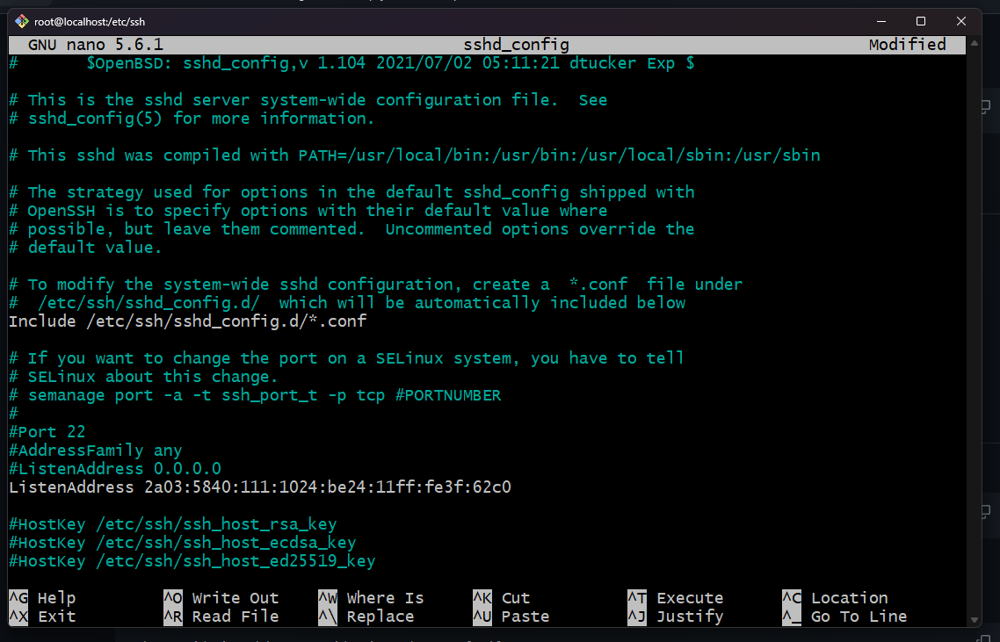

- On redémarre le service


# Les utilisateurs et les groupes

## Création des utilisateurs et des groupes

1. Utilisateurs 

On ajoute les utilisateurs demandé : 
```
sudo useradd -mU webmaster
sudo useradd -mU mshelton -c "Marian Shelton"
sudo useradd -mU ecooper -c "Evelyn Cooper"
```

On change leurs mot de passe :

```
sudo passwd webmaster
sudo passwd mshelton
sudo passwd ecooper
```
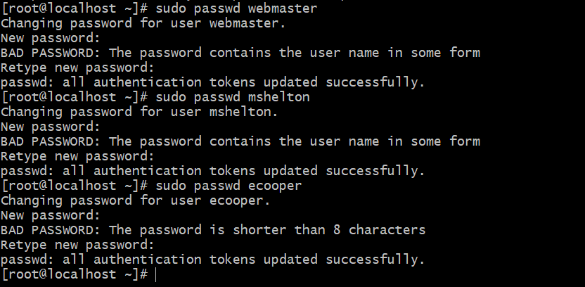

2. Création des groupes :

```
addgroup clpr
addgroup vitrine
addgroup gestion
```

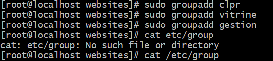

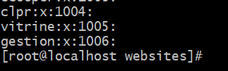

3. Attribution des groupes :

- **Vitrine**
    - webmaster
    - rgagnaire
    - mshelton  - Marian Shelton
- **Gestion**
    - webmaster
    - scagnolati
    - ecooper  - Evelyn Cooper


```
usermod -aG vitrine webmaster
usermod -aG vitrine scagnolati
usermod -aG vitrine mbarr

usermod -aG gestion webmaster
usermod -aG gestion scagnolati
usermod -aG gestion amcfarland
```

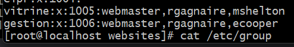

## Création d'une clé SSH pour la connexion pour les utilisateurs

1. On génère une clé SSH 

```
ssh-keygen 
```

2. Ajout de la clé ssh pour les utilisateurs

```
ssh-copy-id -i .ssh/macle.pub webmaster@2a03:5840:111:1024:be24:11ff:fe3f:62c0
ssh-copy-id -i .ssh/macle.pub mshelton@2a03:5840:111:1024:be24:11ff:fe3f:62c0
ssh-copy-id -i .ssh/macle.pub ecooper@2a03:5840:111:1024:be24:11ff:fe3f:62c0
```

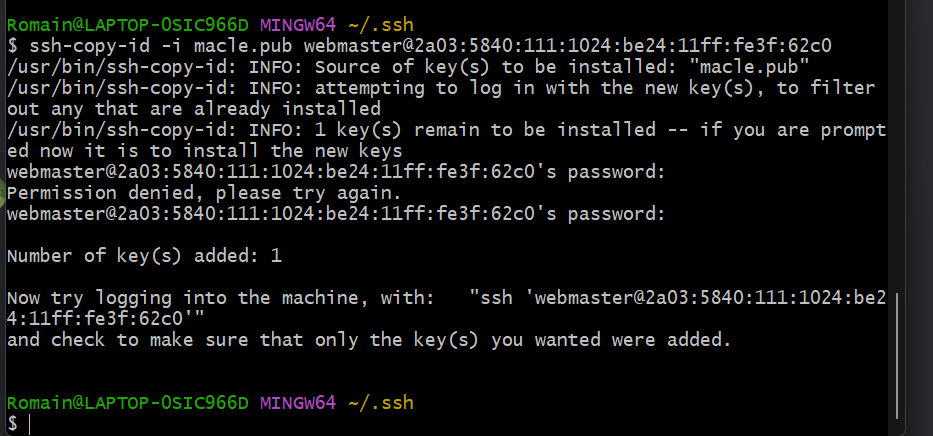

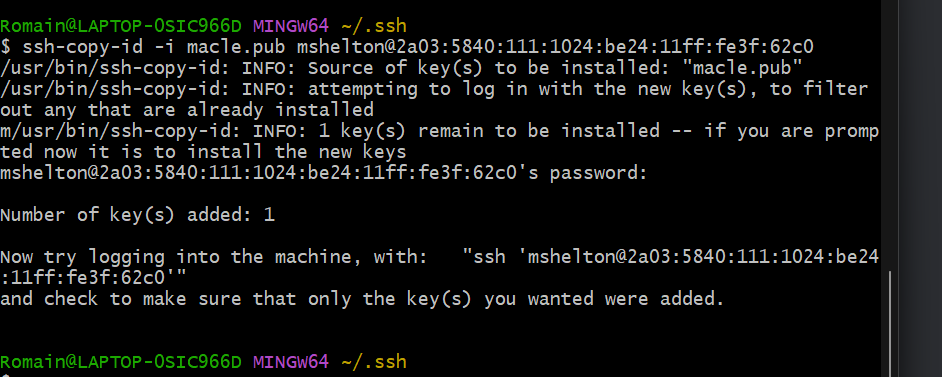

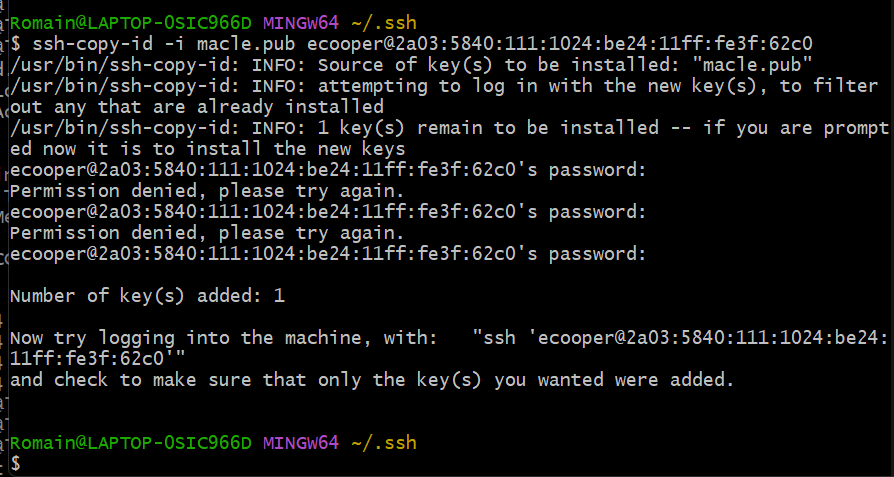


3. On ajoute la clé publique demandé

- On modifie le fichier **~/.ssh/authorized_keys** de chaque utilisateur
- On ajoute à la suite la clé publique

```
ssh-rsa AAAAB3NzaC1yc2EAAAADAQABAAABAQDWsfbTbSlxcvxUL1286nwhwrDPJq6bctkxPpZ+TyujHrDwyymvqEjMJNxiwDPRoomPgOcg+YYUYXbfRiLp0VNlUqA5oG9nhlgtiryZrWY6zrywnsDOk6wJvWA/YNbWLlFN14OiKXOH5KJpgYQh1pLIw1TPeR56vU5wv1Ggb0Jr1sg14TJgm2M4lSmQs1CAY8hBLDj/qQcwVNtuYqTXOulwCPZAzhP6ncHM7lHbwJua/3bGQ8IeFzjRGjL0s2XVECYPufCbM0cX1VtmaSQdVmwqXGW2c+rPAq8cFHecfaw/0fdSMeNV4qSl+VqpCGn/XXnpWAYi0OfifddH80ffdAp5 /home/jerome/.ssh/id_rsa
```

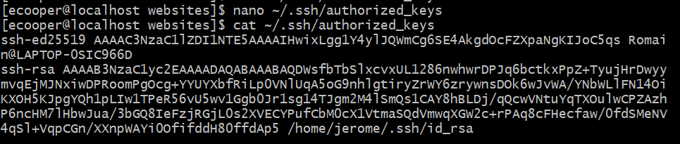

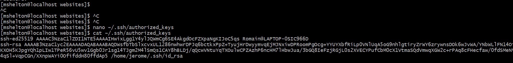

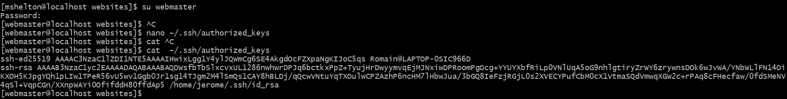

# Arborescence

## Configuration de l'arborescence

1. Configuration demandé :

- **/websites/**
    - **Owner** : Compte Serveur Web _(apache)_
    - **Group** : clpr
    - **Droits** :
        - **u** : rwx
        - **g** : rwx
        - **o** : r-x
- **/websites/vitrine**
    - **Owner** : webmaster
    - **Group** : vitrine
    - **Droits** : 
        - **u** : rwx
        - **g** : rwx
        - **o** : r-x
- **/websites/gestion**
    - **Owner** : webmaster
    - **Group** : gestion
    - **Droits** : 
        - **u** : rwx
        - **g** : rwx
        - **o** : r-x

2. Création des dossiers

```
mkdir /websites/vitrine
mkdir /websites/gestion
```
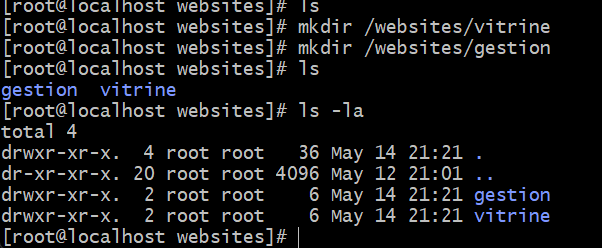

3. Configuration des propriétés et des droits :

```
chown apache:clpr /websites/
chown webmaster:vitrine /websites/vitrine
chown webmaster:gestion /websites/gestion
```

```
chmod 775 /websites
chmod 775 /websites/vitrine
chmod 775 /websites/gestion
```

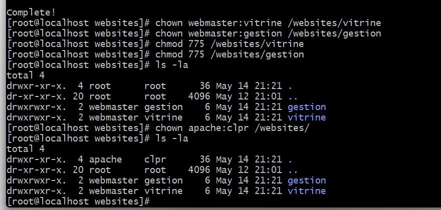

# Logiciels

## Installation des logicels demandé 

1. On met à jour nos paquets

```
sudo dnf update
```
2. SSH
```
sudo dnf install openssh-server
sudo systemctl enable sshd
sudo systemctl start sshd
sudo systemctl status sshd
```

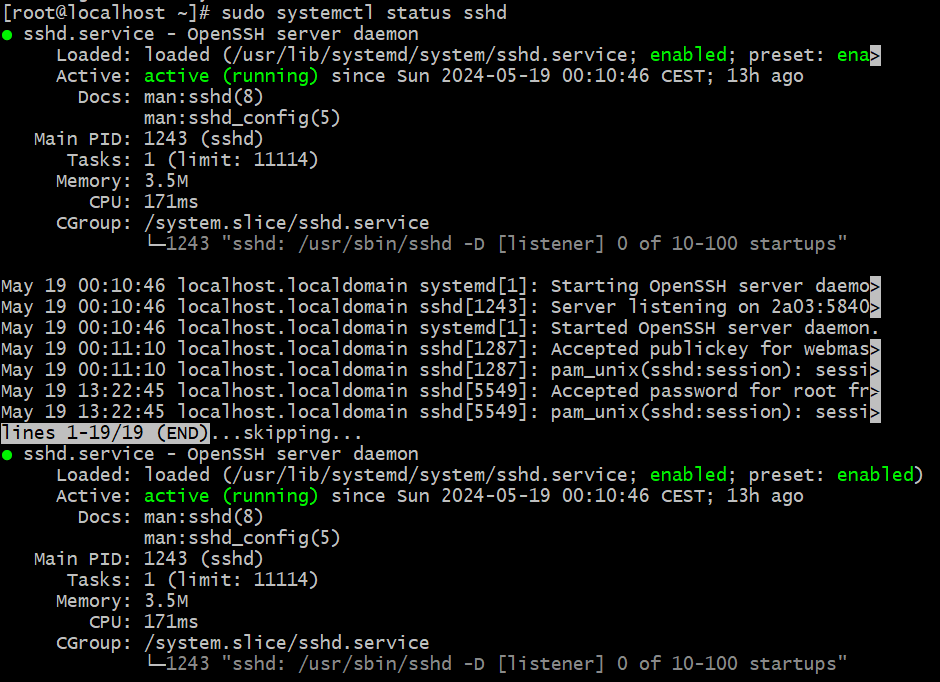

3. outils de compilation
```
sudo dnf group install "Development Tools"
```

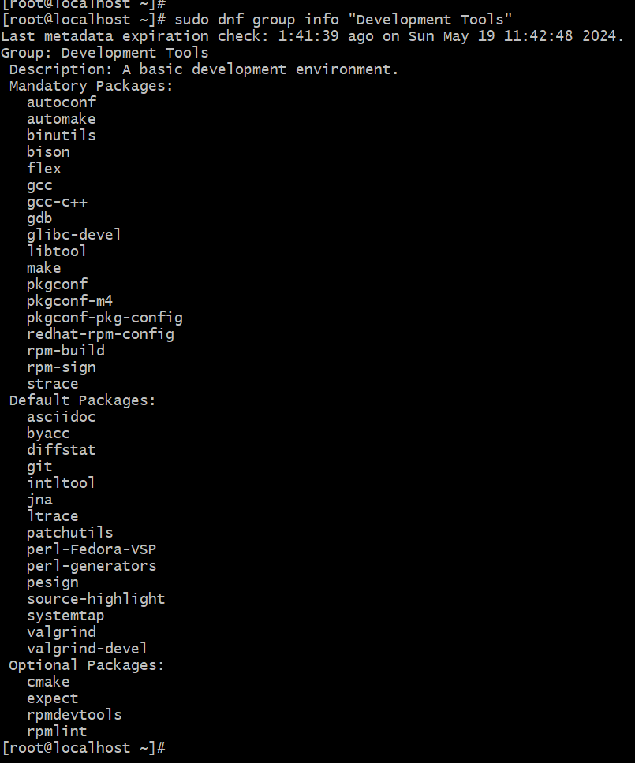

4. SNMP Server
```
sudo dnf install net-snmp net-snmp-utils
sudo systemctl enable snmpd
sudo systemctl start snmpd
sudo systemctl status snmpd
```

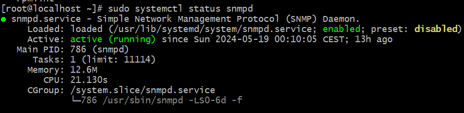

5. Apache
```
sudo dnf install httpd
sudo systemctl enable httpd
sudo systemctl start httpd
sudo systemctl status httpd
```

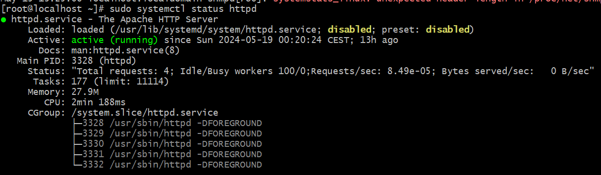

6. Base de donnée MySQL 
```
sudo dnf install https://dev.mysql.com/get/mysql80-community-release-el8-1.noarch.rpm
sudo dnf install mysql-community-server
sudo systemctl enable mysqld
sudo systemctl start mysqld
sudo systemctl status mysqld
```

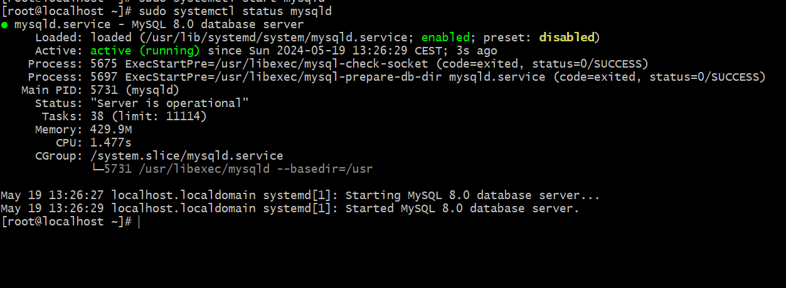

7. PHP
```
sudo dnf install php
sudo systemctl enable php-fpm
sudo systemctl start php-fpm
sudo systemctl status php-fpm
```

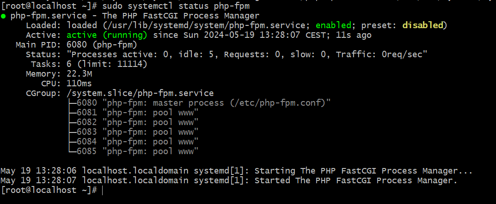

# Les sites webs

## Configuration du site vitrine avec hugo

1. On modifie le fichier httpd.conf pour donner liens de notre site web

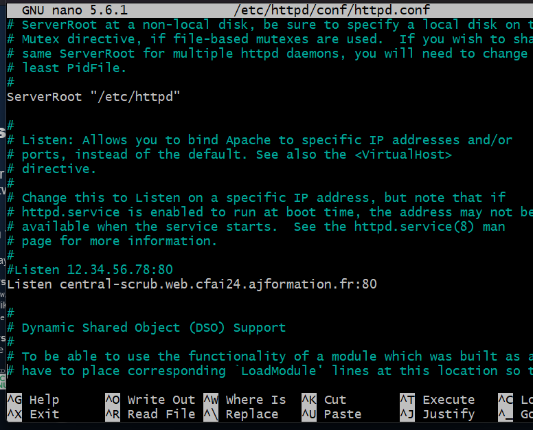

2. Installation et configuration de hugo 
```
cd /websites/vitrine
sudo wget https://github.com/gohugoio/hugo/releases/download/v0.125.5/hugo_extended_0.125.5_Linux-64bit.tar.gz
sudo tar -xzf hugo_extended_0.125.5_Linux-64bit.tar.gz -C /usr/local/bin
hugo new site /website/vitrine/
hugo
```
3. On attribu les droits aux dossiers

```
sudo chown -R webmaster:vitrine /websites/vitrine
```

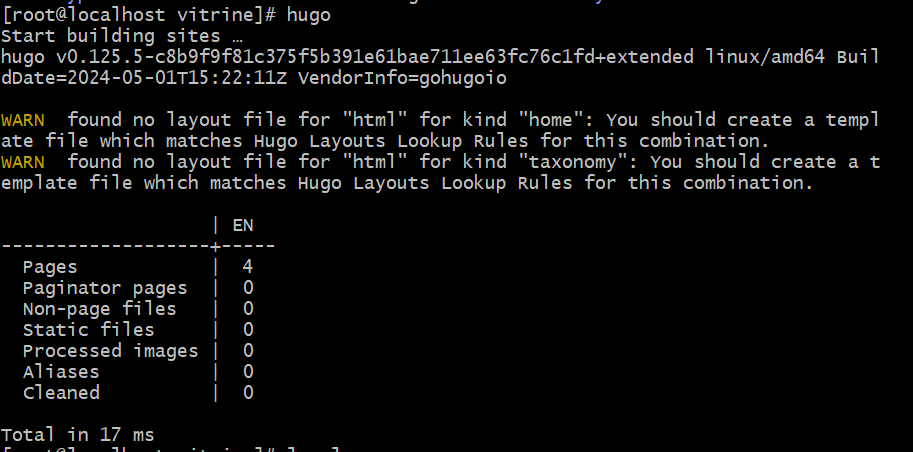

4. Création du fichier de configuration

```
cd /etc/httpd/sites-available
sudo touch vitrine.conf
sudo nano vitrine.conf
```

5. Configuration de ce fichier
```
<VirtualHost *:80>
    ServerName district-ownership.web.cfai24.ajformation.fr
    DocumentRoot /websites/vitrine/public
    <Directory "/websites/vitrine/public">
        AllowOverride All
        Require all granted
    </Directory>
    ErrorLog /var/log/httpd/vitrine_error.log
    CustomLog /var/log/httpd/vitrine_access.log combined
</VirtualHost>
```

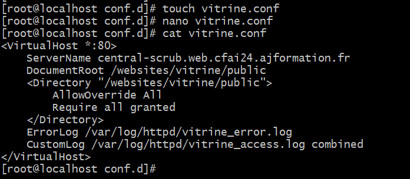

6. Création du liens

```
sudo ln -s /etc/httpd/sites-available/vitrine.conf /etc/httpd/sites-enabled/vitrine.conf
```

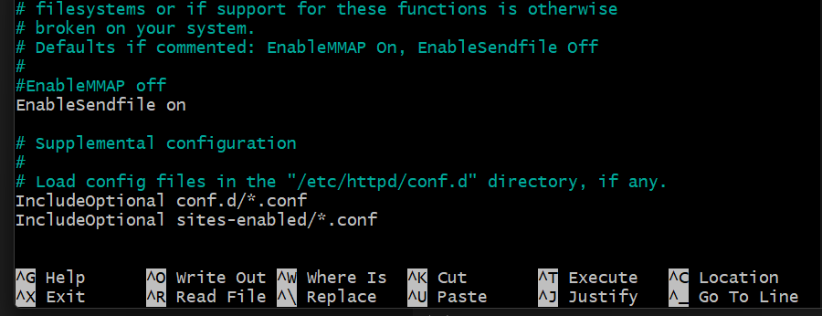

Avant : 


Après :
