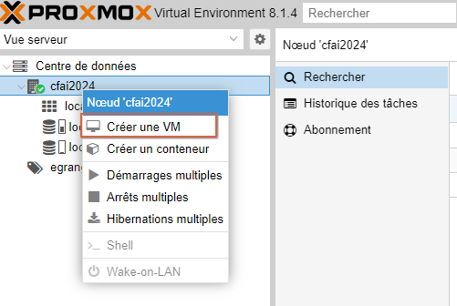
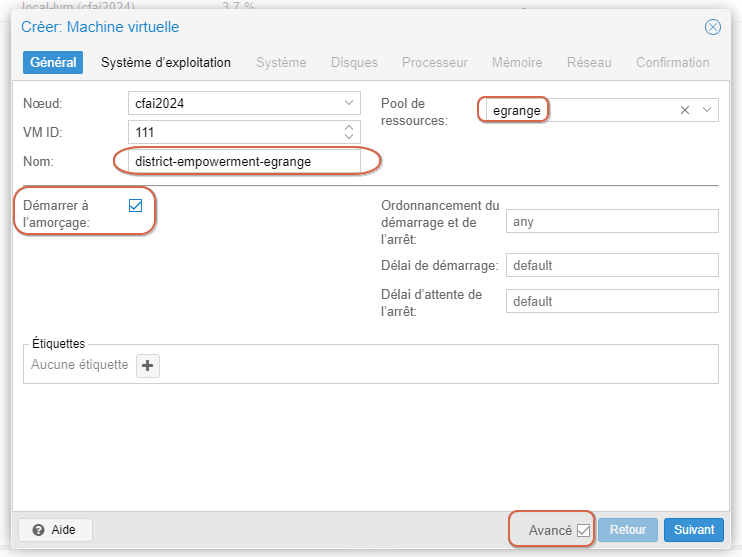
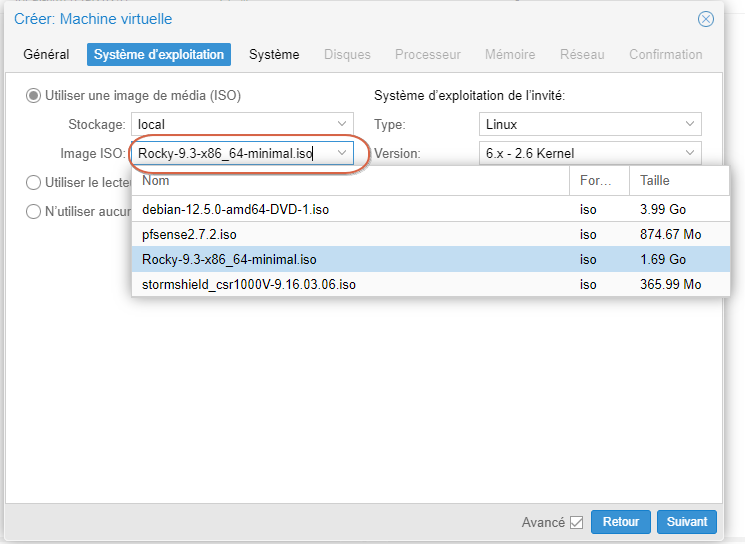
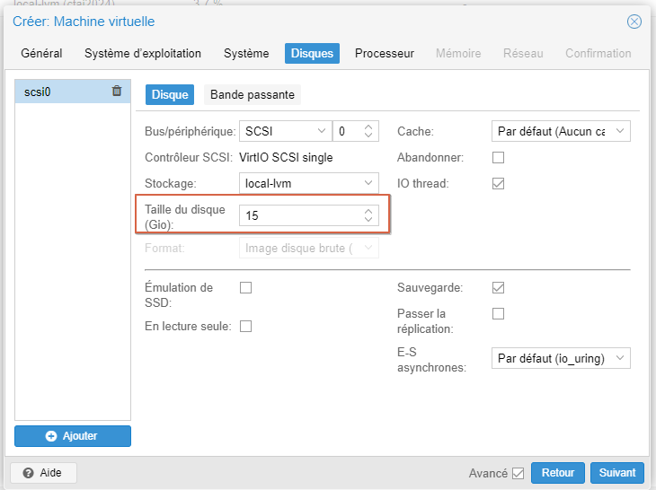
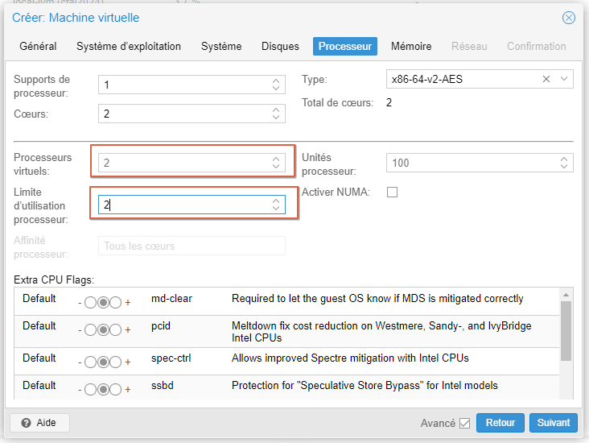
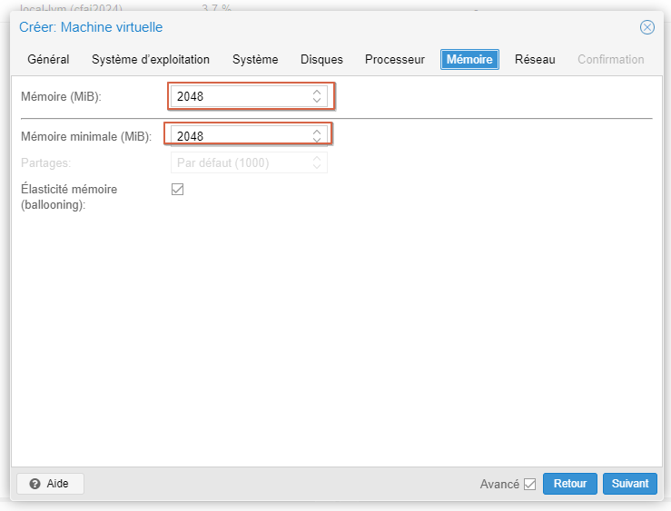
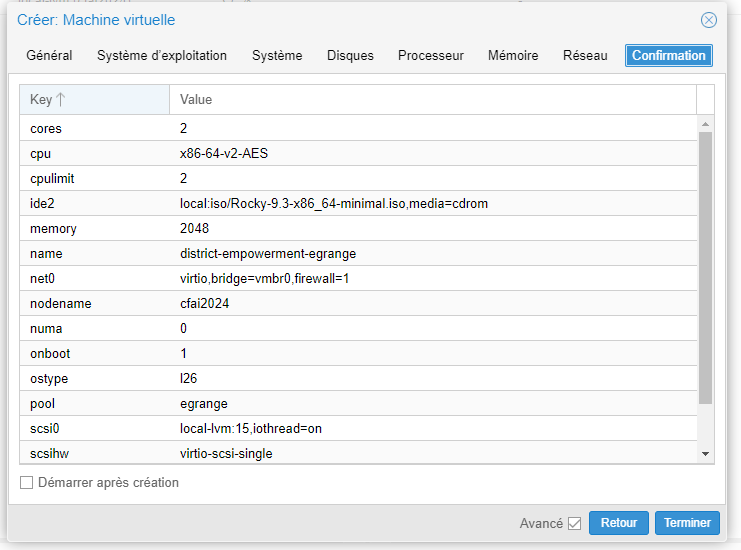

# Etape 1 : Création de la VM Rocky

interface web proxmox : https://cfai2024.ajformation.fr:8006/

## Caractéristiques

La machine virtuelle Rocky doit comporter les caractéristiques suivantes :

* **Name**: district-empowerment-egrange
* **Ressource Pool**: egrange
* **Start at boot** : yes
* **ISO** : Rocky (latest)
* **Disk Size** : 15Go
* **VCPU** : 2
* **RAM** : 2Go
* **Network**  : 1 interface

La distribution linux choisie est : Rocky (latest)

## création et configuration de la VM

**Résumer de la configuration :**

