# Configuration Réseau de la machine 

## objectifs de la partie configuration de la machine et du réseau

- Mise en place du SSH :

    - Désactivation de l'accès root et par mot de passe.

    - Creation d'une clé SSH et connexion par clé

    - Les fichier config (sshd_config, config ...) et les commandes shh ( ssh-agent, ssh-copy-id, ) 


En utilisant la commande **ip a** sur ma machine, je constate que sur l'interface réseau **ens18**, j'ai une adresse **IPv6 globale (:2a03:)** qui sera utilisée pour les connexions SSH. De plus, une autre adresse IPv6 de type **lien local (fe80:)** est également présente, mais elle ne sera pas nécessaire pour ce travail pratique.

Pour mes sites web, il sera nécessaire de **créer une nouvelle adresse IPv6 globale statique** sur l'interface ens18.

Dans cette partie nous allons également configurer SSH. Normalement, sur un serveur Rocky Linux, nous avons dejà le paquet SSH **openssh-server**, sinon nous pouvons l'installer avec la commande `sudo dnf install openssh-server` et `sudo dnf update` pour mettre à jours les paquets.


## savoir son adresse ipv6 global pour le SSH

J'utilise la commande `ip a` afin de voir toutes mes interfaces réseaux. Sur l'interface ens18, je vois mon adresse global IPV6 qui me permettra d'accéder à ma machine à l'aide de SSH.

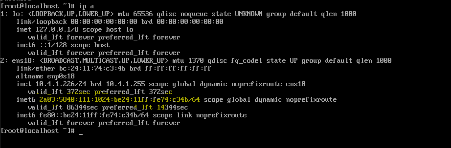

mon adresse IPV6 global pour le SSH est :
 - **2a03:5840:111:1024:be24:11ff:fe74:c34b / 64**

 # Configuration du SSH 

  ### **Procédure :**

 1. Se connecter avec SSH en utilisant l'identifiant d'un utilisateur et son mot de passe.
    - Commande : `ssh nomUtilisateurDistant@adresseIPV6DeDestination`

2. Copier la clé publique préalablement créée dans le fichier .ssh authorized-keys.
   - Commande pour créer sa clé: `ssh-keygen -f ./.ssh/customer-ideation -t ed25519`

3. Créer un fichier config sur son ordinateur personnel pour créer un raccourci SSH vers la machine Rocky.
   - Préciser un serveur de proxy pour accéder à l'IPv6 ( si nous n'avons pas IPV6 d'activé).
   - Préciser l'host.
   - Précicer le chemin de la clé privé

4. Dans le fichier sshd_config :
   - Désactiver la connexion via mot de passe.
   - Désactiver la connexion root.
   - Autoriser la connexion SSH uniquement via l'adresse IPv6.

### Réalisation :

 La premiere étape et de se connecter avec SSH avec l'identifiant d'un utilisation ( ici : egrange) et son mot mot de passe.

 La commande est : 

 ```
 ssh egrange@2a03:5840:111:1024:be24:11ff:fe74:c34b

```

 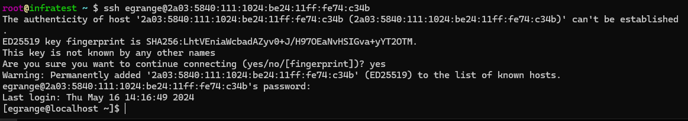.

Lorsque j'établis une connexion SSH avec un nouvel ordinateur pour la première fois, je rencontre  ce message : **"Are you sure you want to continue connecting (yes/no/[fingerprint])?".** Cette question m'invite à confirmer que je souhaite vraiment poursuivre la connexion. C'est une mesure de sécurité mise en place par SSH, qui suit le principe **TOFU** (Trust On First Use), ou confiance lors de la première utilisation.

En répondant "yes", je permets à mon client SSH d'enregistrer la clé publique de l'ordinateur distant dans un fichier local (par exemple, **~/.ssh/known_hosts**). En cas de changement de clé publique, mon client SSH m'alertera, évitant ainsi les risques d'attaques de type **"Man-in-the-Middle"**. 

Je créer un fichier caché **.ssh** ( je peux m'aider du fichier qui a été créer automatiquement dans le répertoire de l'utilisateur root) et je copie ma clé publique générée préalablement, ainsi que la clé du 
proffesseur fan de linux.

 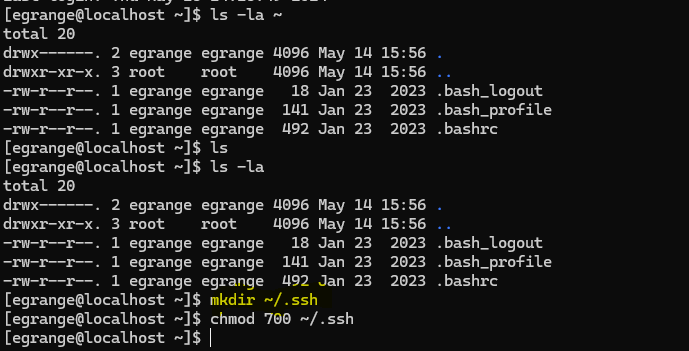.

Une fois à l'intérieur, j'ajoute les clé publique dans le fichier nommé authorized_keys.

 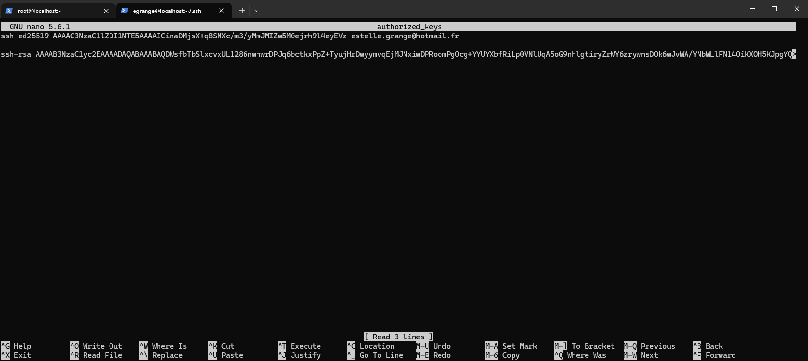.

voir la clé trouvée du professeur :

<details>
<summary>&nbsp; 
Voir la clé de Jérôme Avond &nbsp;</summary>
ssh-rsa AAAAB3NzaC1yc2EAAAADAQABAAABAQDWsfbTbSlxcvxUL1286nwhwrDPJq6bctkxPpZ+TyujHrDwyymvqEjMJNxiwDPRoomPgOcg+YYUYXbfRiLp0VNlUqA5oG9nhlgtiryZrWY6zrywnsDOk6wJvWA/YNbWLlFN14OiKXOH5KJpgYQh1pLIw1TPeR56vU5wv1Ggb0Jr1sg14TJgm2M4lSmQs1CAY8hBLDj/qQcwVNtuYqTXOulwCPZAzhP6ncHM7lHbwJua/3bGQ8IeFzjRGjL0s2XVECYPufCbM0cX1VtmaSQdVmwqXGW2c+rPAq8cFHecfaw/0fdSMeNV4qSl+VqpCGn/XXnpWAYi0OfifddH80ffdAp5 /home/jerome/.ssh/id_rsa
</details>
.

Une fois copier, je  créer  un fichier config sur mon ordianteur personnel afin de créer un raccourcie ssh vers ma machine Rocky. Je précise également un serveur de proxy me permettant de pouvoir accéder à l'IPV6, car de base je posséde uniquement de l'IPV4.

mon fichier config : 

```
HOST rocky
        hostname 2a03:5840:111:1024:be24:11ff:fe74:c34b
        user egrange
        Identityfile C:\Users\assee\.ssh\id_ed25519
        proxyJump HOSTBUSTER

```

*Note* : plus tard, je pourrais mettre le FQDN au lieu de l'adresse IP.

Puis dans le fichier sshd_config , je desactive la connexion via mot de passe, la connexion root et j'autorisera la connexion SSH unqiuement via mon adresse IPV6 

#### Les commandes ssh :

Certaine commande ne fonctionne pas sous Windows tel que ssh-copy-id qui permet de directement envoyer sa clé vers le serveur de destination et les commandes ssh-agent qui permet d'éviter de recopier la phrase lors de la connexion avec une clé.

####  le fichier sshd_config

- Pour **interdire la connexion via l'utilisateur root**, je modifie le fichier **/etc/ssh/sshd_config**.
 je passe l'autorisation **PermitRootLogin** à **no** et rédemarre le service avec la commande `systemctl restart sshd`

  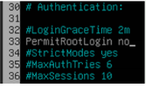.

- **Autorisation de la connexion SSH uniquement depuis l'adresse IPv6 2a03:5840:111:1024:be24:11ff:fe74:c34b**
  
    - je modifie le fichier **/etc/ssh/sshd_config**
    • j'ajoute l'adresse IPv6 à la directive **ListenAddress** et je redémarre le service le service.

    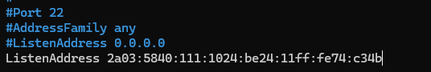.

- **Interdiction de se connecter via un mot de passe**
    - On modifie le fichier **/etc/ssh/sshd_config**
    - On passe les autorisations **PasswordAuthentification**, **PermitEmptyPassword** et **ChallengeResponseAuthentication** à **no** et je redémarre le service ssh une fois les modifications du fichiers sauvegardées avec la commande `systemctl restart sshd`.
    
    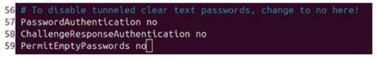.

# Ajouter une adresse IPV6 global

Rocky Linux utilise principalement NetworkManager pour la gestion des connexions réseau.

J'ai créer une adresse IPV6 pour mes sites webs , afin d'éviter les conflits d'IP avec mes camarades de classes, un fichier a été mit à disposition par Solène : [Administration Linux - IPv6](https://docs.google.com/spreadsheets/d/1V8o3TDtap5S8ppwWNqIwPzmyeoWmFgG2QRDR0904q9Y/edit#gid=0).

Mon adresse ipv6 pour les sites webs est : **2A03:5840:111:1024::77** 

Je l'ai choisie au hasard et également pour sa simplicitée. 

J'utilise la commande suivante afin d'ajouter cette adresse à mon interface ens18 :

```bash
 sudo nmcli connection modify ens18 ipv6.addresses "2a03:5840:111:1024:be24:11ff:fe74:c34b, 2A03:5840:111:1024::77/64"

 sudo nmcli connection up ens18
```

<u> Explication de la commande :</u>

- **sudo**: Exécutez la commande avec les privilèges administratifs.

- **nmcli connection modify ens18**: Modifie la configuration de la connexion réseau associée à l'interface **ens18**.

- **ipv6.addresses '2a03:5840:111:1024:be24:11ff:fe74:c34b, 2A03:5840:111:1024::77/64'**: Définit les adresses IPv6 statique pour l'interface ens18.

- **ipv6.method manual**: Définit la méthode d'attribution d'adresse IPv6 sur manuelle, indiquant que l'adresse est statique.

- **sudo nmcli connection up ens18** : applique la modification.

Ensemble, ces commande modifie la configuration de l'interface réseau ens18, je vérifie la configuration en exécutant `nmcli connection show ens18 ` ou `ip a` .

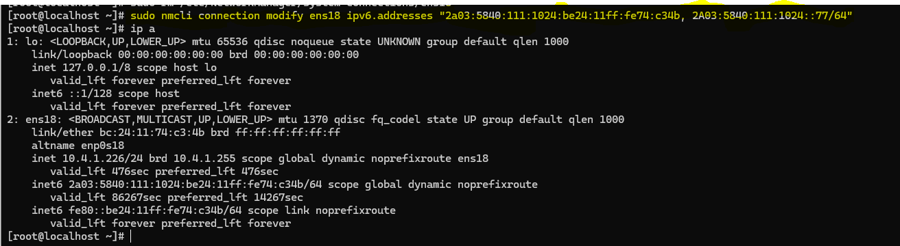.

Les deux adresses IPv6 configurées sur l'interface ens18 sont en **scope global**. Cela signifie qu'elles sont routables sur l'ensemble du réseau IPv6 et peuvent être utilisées pour communiquer avec d'autres appareils sur Internet.

# Mise en place du FQDN

Les enregistrements DNS cfai24.ajformation.fr sont dans l'outil <http://ns1.cfai2024.ajformation.fr:5000/>

<u> Voici les 3 enregistrements : </u>

* **district-empowerment.vm.cfai24.ajformation.fr** : pour l'accès SSH

* **district-empowerment.web.cfai24.ajformation.fr** : pour le site web vitrine

* **district-empowerment.admin.cfai24.ajformation.fr** : pour le site web de gestion


## Enregistrement FQDN de la VM ( pour le SSH): 

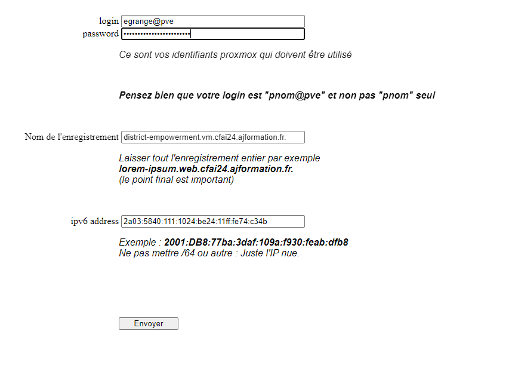.

Testez le nouvel enregistrement

avec une ligne de commande :

```
    $ dig +short AAAA district-empowerment.vm.cfai24.ajformation.fr.
    2a03:5840:111:1024:be24:11ff:fe74:c34b

    $ host district-empowerment.vm.cfai24.ajformation.fr.
    district-empowerment.vm.cfai24.ajformation.fr. has IPv6 address 2a03:5840:111:1024:be24:11ff:fe74:c34b

    $ resolvectl query district-empowerment.vm.cfai24.ajformation.fr.
    district-empowerment.vm.cfai24.ajformation.fr.: 2a03:5840:111:1024:be24:11ff:fe74:c34b -- link: whatever

    -- Information acquired via protocol DNS in 34.7ms.
    -- Data is authenticated: no; Data was acquired via local or encrypted transport: no
    -- Data from: network

```


[Vérifier la résolution DNS sur whatsmydns.net](https://www.whatsmydns.net/) : 


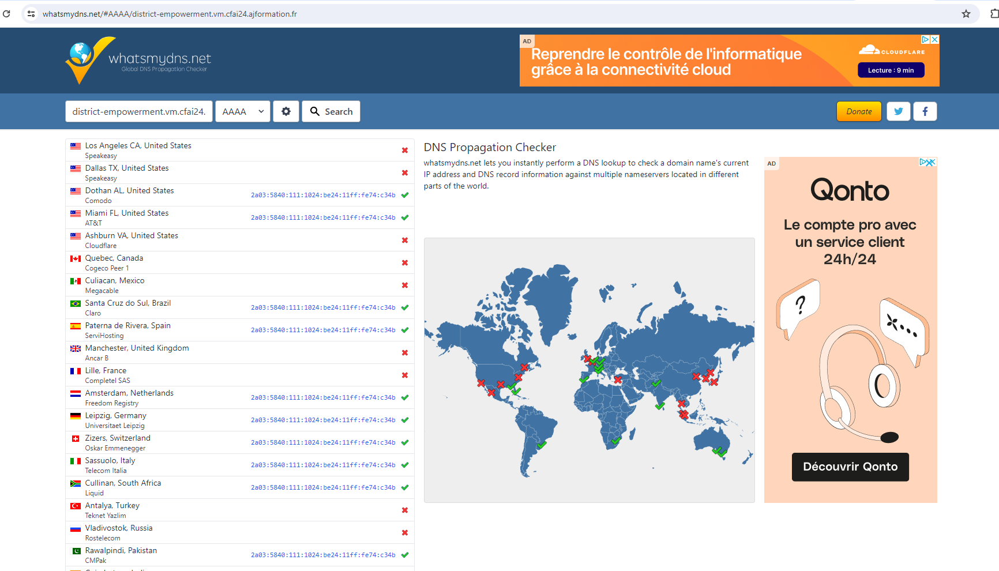.


## Enregistrement FQDN pour les sites vitrines: 

<u> district-empowerment.web.cfai24.ajformation.fr </u> :
```
Testez l'enregistrement

ligne de commande :


    $ dig +short AAAA district-empowerment.web.cfai24.ajformation.fr.
    2A03:5840:111:1024::77

    $ host district-empowerment.web.cfai24.ajformation.fr.
    district-empowerment.web.cfai24.ajformation.fr. has IPv6 address 2A03:5840:111:1024::77

    $ resolvectl query district-empowerment.web.cfai24.ajformation.fr.
    district-empowerment.web.cfai24.ajformation.fr.: 2A03:5840:111:1024::77 -- link: whatever

    -- Information acquired via protocol DNS in 34.7ms.
    -- Data is authenticated: no; Data was acquired via local or encrypted transport: no
    -- Data from: network

```

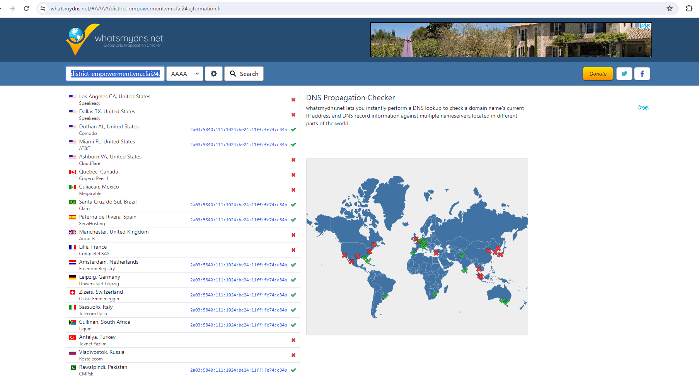.


<u> district-empowerment.admin.cfai24.ajformation.fr </u> :
```

ligne de commande :


     $ dig +short AAAA district-empowerment.admin.cfai24.ajformation.fr.
    2A03:5840:111:1024::77

    $ host district-empowerment.admin.cfai24.ajformation.fr.
    district-empowerment.admin.cfai24.ajformation.fr. has IPv6 address 2A03:5840:111:1024::77

    $ resolvectl query district-empowerment.admin.cfai24.ajformation.fr.
    district-empowerment.admin.cfai24.ajformation.fr.: 2A03:5840:111:1024::77 -- link: whatever

    -- Information acquired via protocol DNS in 34.7ms.
    -- Data is authenticated: no; Data was acquired via local or encrypted transport: no
    -- Data from: network

```

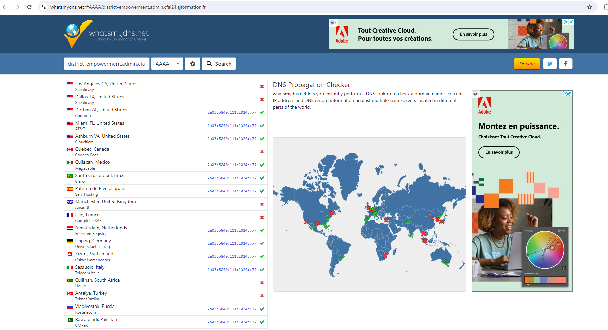.