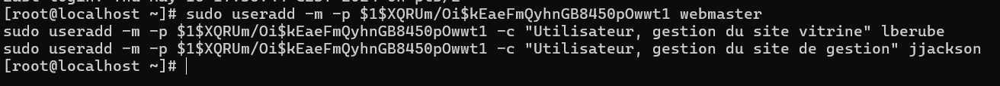
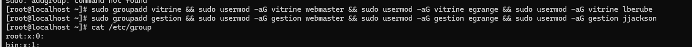

# Configuration les utilisateurs et les groupes

## travaux demandés

- Ajouter l'utilisateur **egrange** au groupe sudo.

> En tant qu'administrateur de la machine vous créerez votre compte egrange, et aurez l'entière responsabilité de l'administration de la machine (compte root).
Vous fournirez néamoins le mot de passe du compte root dans votre rapport !
Vous garderez votre mot de passe personnel SECRET !

- créer les comptes suivants :

    - **webmaster** : compte service
    - **lberube** (Lori Berube ) : Utilisateur, gestion du site vitrine
    - **jjackson** (John Jackson): Utilisateur, gestion du site de gestion

- créer les groupes suivants :

    - Groupe: **vitrine**
        - utilisateurs:
            - webmaster
            - egrange
            - lberube - Lori Berube

    - Groupe: **gestion**
        - utilisateurs:
            - webmaster
            - egrange
            - jjackson - John Jackson

## Commandes 

| Fonctionnalité            | Commande Linux (Rocky Linux)                                            | Description                                                                                                                                                               |
|---------------------------|-------------------------------------------------------------------------|---------------------------------------------------------------------------------------------------------------------------------------------------------------------------|
| Créer un utilisateur     | `useradd -m -p <mot_de_passe_crypté> <nom_utilisateur>`               | Crée un utilisateur avec un mot de passe crypté et un répertoire utilisateur. Il est recommandé d'utiliser `passwd` après la création pour définir un mot de passe sécurisé. |
| Ajouter un membre sudoer | `sudo adduser <nom_utilisateur> sudo`                                   | Ajoute un utilisateur au groupe sudo pour accéder aux droits sudo.                                                                                                         |
| Ajouter un utilisateur à un groupe | `sudo adduser <nom_utilisateur> <nom_du_groupe>`                 | Ajoute un utilisateur à un groupe et crée le groupe s'il n'existe pas.                                                                                                     |
| Créer un groupe           | `sudo groupadd <nom_du_groupe>`                                        | Crée un nouveau groupe.                                                                                                                                                   |
| Crypter un mot de passe   | `openssl passwd -1 "mot de passe" `

## Création des utilisateurs:

```
sudo useradd -m -p $1$XQRUm/Oi$kEaeFmQyhnGB8450pOwwt1 webmaster
sudo useradd -m -p $1$XQRUm/Oi$kEaeFmQyhnGB8450pOwwt1 -c "Utilisateur, gestion du site vitrine" lberube
sudo useradd -m -p $1$XQRUm/Oi$kEaeFmQyhnGB8450pOwwt1 -c "Utilisateur, gestion du site de gestion" jjackson
```



## Création des groupes

### le groupe vitrine
```
sudo groupadd vitrine
sudo adduser webmaster vitrine
sudo adduser egrange vitrine
sudo adduser lberube vitrine
```

### le groupe gestion 

```
sudo groupadd gestion
sudo adduser webmaster gestion
sudo adduser egrange gestion
sudo adduser jjackson gestion
```

