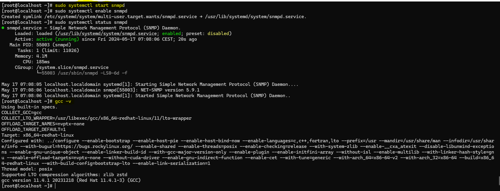
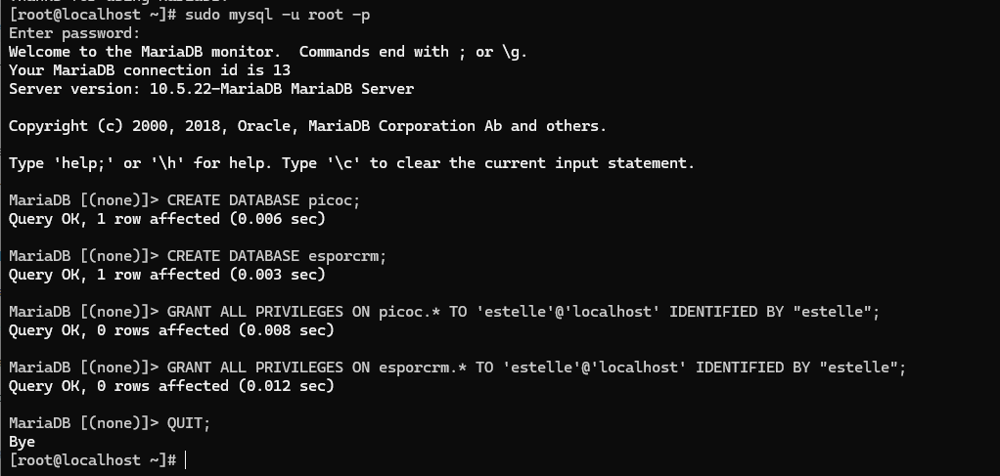

# Outils et services

La machine doit disposer des logiciels suivants :

- serveur ssh
- outils de compilation (gcc,make...)
- snmp server
- apache
- mysql
- php (dernière version, fonctionne avec apache)

# outils : 

### ssh 
```
sudo dnf install openssh-server
```

### outil de compilation
```
sudo dnf install gcc
```

### smtp

| Commande                                           | Description                                                        |
|----------------------------------------------------|--------------------------------------------------------------------|
| `sudo dnf update`                                  | Mettre à jour le système                                           |
| `sudo dnf install net-snmp`                        | Installer le paquet SNMP daemon                                    |
| `sudo systemctl start snmpd`                       | Démarrer le service SNMP                                           |
| `sudo systemctl enable snmpd`                      | Activer le service SNMP pour qu'il démarre automatiquement        |
| `sudo systemctl status snmpd`                      | Vérifier le statut du service SNMP                                 |

### les outils :



## Apache, php et mySql

| Étape                                    | Commande(s)                                                                                             | Description                                                        |
|------------------------------------------|---------------------------------------------------------------------------------------------------------|--------------------------------------------------------------------|
| Passer en super utilisateur              | `su -`                                                                                                  | Passer en mode super utilisateur                                   |
| Mettre à jour les paquets                | `sudo dnf update && sudo dnf upgrade`                                                                   | Mettre à jour tous les paquets du système                          |
| Installer le dépôt EPEL                  | `sudo dnf install epel-release`                                                                         | Installer le dépôt EPEL                                            |
| Activer le module PHP 8.2                | `sudo dnf module enable php:8.2`                                                                        | Activer le module PHP 8.2                                          |
| Installer Apache                         | `sudo dnf install httpd`                                                                                 | Installer le serveur web Apache                                    |
| Démarrer et activer Apache               | `sudo systemctl start httpd` <br> `sudo systemctl enable httpd`                                          | Démarrer et activer Apache au démarrage                            |
| Installer PHP et les modules requis      | `sudo dnf install php php-ldap php-curl php-gd php-mysqlnd`                                              | Installer PHP 8.2 et les modules nécessaires                       |
| Installer MariaDB                        | `sudo dnf install mariadb-server`                                                                        | Installer le serveur de base de données MariaDB                    |
| Démarrer et activer MariaDB              | `sudo systemctl start mariadb` <br> `sudo systemctl enable mariadb`                                      | Démarrer et activer MariaDB au démarrage                           |
| Sécuriser l'installation de MariaDB  et répondre yes. le mot de passe est **Estelle2024!**     | `sudo mysql_secure_installation`                                                                         | Sécuriser MariaDB en suivant les instructions                      |
| Créer les bases de données (estelle est le mot de passe pour l'utilisateur estelle)               | `sudo mysql -u root -p` <br> `CREATE DATABASE picoc;` <br> `CREATE DATABASE esporcrm;` <br> `GRANT ALL PRIVILEGES ON picoc.* TO 'estelle'@'localhost' IDENTIFIED BY "estelle";` <br> `GRANT ALL PRIVILEGES ON esporcrm.* TO 'estelle'@'localhost' IDENTIFIED BY "estelle";` <br> `QUIT;` | Créer les bases de données et un utilisateur avec les privilèges nécessaires |
| Installer PhpMyAdmin                     | `sudo dnf install phpmyadmin`                                                                            | Installer PhpMyAdmin pour gérer MariaDB via une interface graphique|
| Redémarrer le service Apache             | `sudo systemctl restart httpd`                                                                           | Redémarrer le service Apache                                       |
| Redémarrer le service MariaDB            | `sudo systemctl restart mariadb` 


