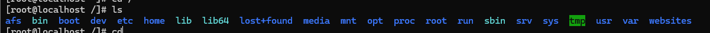
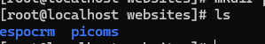
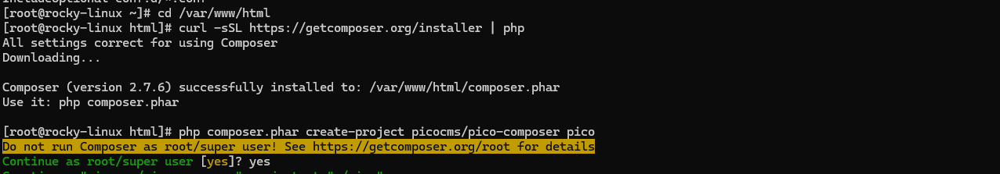
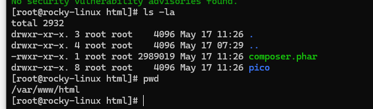
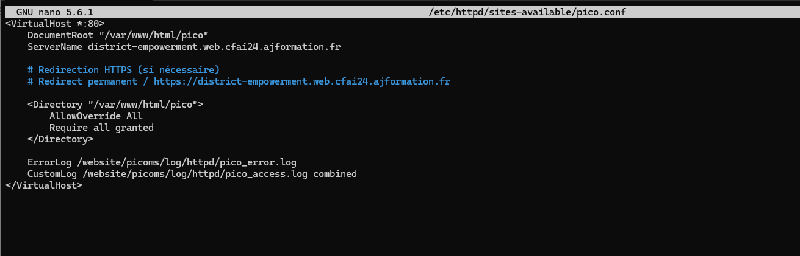
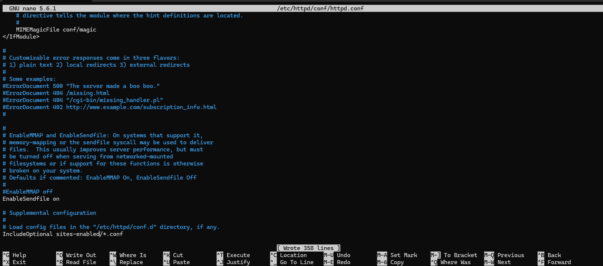

# Les sites Webs

les sites web a installer:

    -site vitrine : https://picocms.org/
    -site gestion : https://www.espocrm.com/download/

Dans les dossiers **/websites** dédiés.



### repertoire des dossiers :



Il faudra bien entendu donner les différents droit a Apache pour ecrire et lire dans les dossiers, et à MariaDb pour les fichiers de bases de données.

Sur Rocky linux le dossier apache se trouve dans **/etc/httpd** et le nom d'utilisateurpour service HTTPS et également apache.

# Installation de Pico CMS sur un serveur Rocky Linux

## Étape 1: Préparer mon environnement
- Apache installé et configuré (fait)
- PHP installé (fait)
- Composer installé (pas fait)

Pour installer Composer :

```shell
curl -sSL https://getcomposer.org/installer | php
sudo mv composer.phar /usr/local/bin/composer
```

## Étape 2: intallation du serveur Pico

Je navigue vers le répertoire `httpdocs` → `/var/www/html` c'est ici que ce trouvera la racine de mon serveur web Pico, j'ajoute un repertoire Pico et je modifierais le DocumentRoot dans Apache.

```sh
cd /var/www/html
curl -sSL https://getcomposer.org/installer | php
php composer.phar create-project picocms/pico-composer pico
```


## Étape 3: Configuration des permissions

<u>droit de bases :</u> 


Donner les droits Apache afin qu'il puissent écrire dans le dossier :

```
# A l'endroit où est installé pico
sudo chown -R apache:apache /var/www/html/pico
sudo chmod -R 755 /var/www/html/pico

#les logs
sudo mkdir -p /websites/picoms/log/httpd/
sudo chown -R apache:apache /websites/picoms/log/httpd/
sudo chmod -R 755 /websites/picoms/log/httpd/

```

### Configuration  SELinux :

```
sudo semanage fcontext -a -t httpd_log_t "/websites/picoms/log/httpd(/.*)?"
sudo restorecon -Rv /websites/picoms/log/httpd/

```

## Deplacement du fichier :

## Etape 4 : configuration du VirtualHost

[lien du site vitrine](http://district-empowerment.web.cfai24.ajformation.fr)

```
sudo mkdir -p /etc/httpd/sites-available
sudo mkdir -p /etc/httpd/sites-enabled

sudo nano /etc/httpd/sites-available/pico.conf
```
<u> Mon fichier **pico.conf** : </u>



```
<VirtualHost *:80>
    DocumentRoot "/var/www/html/pico"
    ServerName district-empowerment.web.cfai24.ajformation.fr

    # Redirection HTTPS (si nécessaire)
    # Redirect permanent / https://district-empowerment.web.cfai24.ajformation.fr

    <Directory "/pico">
        AllowOverride All
        Require all granted
    </Directory>

    ErrorLog /websites/picoms/log/httpd/pico_error.log
    CustomLog /websites/picoms/log/httpd/pico_access.log combined
</VirtualHost>
```

Puis il faut redémarer le service Apache ```systemctl restart httpd```

### activer le site et redémarrer le service apache
```
ln -s /etc/httpd/sites-available/pico.conf /etc/httpd/sites-enabled/pico.conf

nano /etc/httpd/conf/httpd.conf 

sudo systemctl restart httpd

```

dans le fichier **/etc/httpd/conf/httpd.conf** qui est le fichier principal d'apache , j'ajoute 2  
éléments 
```
# Inclure les configurations des sites activés
IncludeOptional sites-enabled/*.conf

ServerName localhost

```



### test :