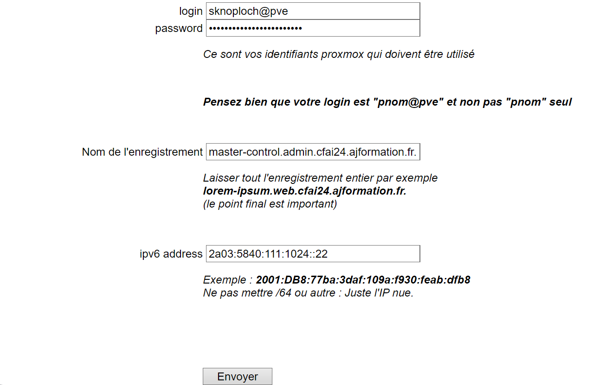

# Projet Web

# Identité
Nom : KNOPLOCH

Prénom : Sacha

# Rapport d'activités

# Création de la VM
 Temps de réalisation : 1h

 Travaux réalisés:
 1. Création de la VM
 2. Partionnement de la VM et création des users root et sknoploch
 3. Update des packages avec la commande : sudo dnf update && sudo dnf upgrade -y

 # Ajout d'une IPv6 

 Temps de réalisation : 20 min

Travaux réalisés: 
Ajout d'une adresse IPv6 à l'aide de cette commande : sudo nmcli con mod ens18 ipv6.addresses "2a03:5840:111:1024:be24:11ff:fe17:5111/64,2a03:5840:111:1024::22/64 

# Enregistrement DNS
 Temps de réalisation : 20 min

Travaux réalisés: Enregistrement des fqdn

|FQDN | IPv6 |  
|----------|----------|
|  master-control.admin.cfai24.ajformation.fr | 2a03:5840:111:1024::22  
| master-control.web.cfai24.ajformation.fr  |  2a03:5840:111:1024::22 
|  master-control.vm.cfai24.ajformation.fr  | 2a03:5840:111:1024:be24:11ff:fe17:5111  | 

