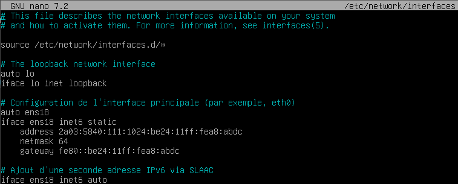
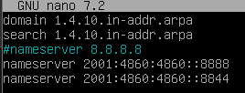
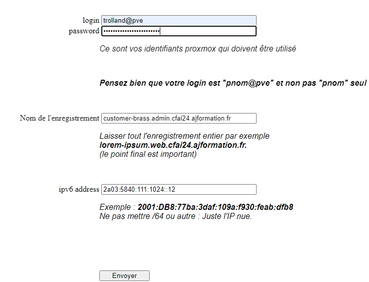
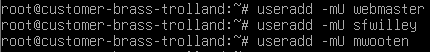

# Rapport du site web 

## Création de VM ##
J'ai du recréé ma VM a plusieurs tentatives suite a plusieurs erreur de config (parti graphique, HDD trop gros) ou encore des oublies de mot de passe (my bad)
Ensuite une fois bien installé j'ai eu de grosse difficulté a mettre les interfaces réseaux correctement voici les commandes que j'ai rentré dans /etc/network/interfaces 

Mais visiblement ca ne fonctione pas ^^

Puis j'ai compris mon erreur après des recherches sur internet il faut que je mette en static ma seconde adresse ip qui fini en "::12"

Alors j'ai pu faire mon enregistrement DNS mais je n'ai plus internet et je ne peux pas prendre ma machine a distance 
Après des recherches sur internet j'ai éssayé de configurer les serveurs DNS IPv6 :
Dans le fichier /etc/resolv.conf
j'avais un nameserver 8.8.8.8 n'ayant pas d'adresse IPv4 j'ai supprimer ce nameserveur et j'ai remplacer par deux de google en IPv6 
ce qui donne ceci :

Malgré cette modification, j'ai toujours pas d'internet et pour la suite je vais etre coincé j'ai donc laissé de coté pour le moment j'ai fait tout ce qui est possible sans internet.

## Enregistrement DNS 

| FQDN| Adresse IPv6| Utilisation|
|-|-|-|
|customer-brass.vm.cfai24.ajformation.fr| 2a03:5840:111:1024:be24:11ff:fea8:abdc|Accès SSH|
|customer-brass.web.cfai24.ajformation.fr| 2a03:5840:111:1024::12| Site web vitrine|
|customer-brass.admin.cfai24.ajformation.fr| 2a03:5840:111:1024::12| Site web de gestion |

## Création des utilisateurs

J'ai ensuite attribué des mots de passe a tout les utilisateurs :

Webmaster : mast3r
sfwilley : will3y
mwooten : w00ten

j'ai pas mis de mot de passe pour root, simplement avec discution d'un administrateur linux a mon travail il m'a dis je cite " On ne met jamais de mot de passe à root " pour des questions de sécurité.

## Création des fichiers 

### créer les différents dossiers :
mkdir -p /websites \
mkdir -p /websites/vitrine\
mkdir -p /websites/gestion

### Donner les permissions au différents dossiers

Pour ce faire j'ai demandé de l'aide à chat GPT
Il m'a fais créé des groupes comme clpr vitrine et gestion

Puis il m'a fait taper ces lignes de code :\
chown www-data:clpr /websites/\
chown webmaster:vitrine /websites/vitrine\
chown webmaster:gestion /websites/gestion

Après avoir attribué les propriétaires et les groupes, je définis les permissions pour ces dossiers.

chmod 775 /websites\
chmod 775 /websites/vitrine\
chmod 775 /websites/gestion

Les permissions 775 correspondent à :

u=rwx (le propriétaire a tous les droits)\
g=rwx (le groupe a tous les droits)\
o=rx (les autres peuvent lire et exécuter)
