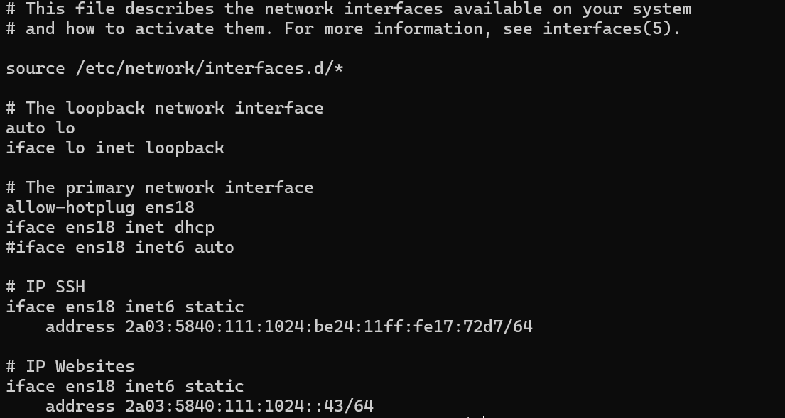

# Auteur : Titouan Bonnet Plomb

1. Création de la VM (20 minutes)
2. Installation des services necessaire (10 minutes)
3. Parametrage du réseau en IPv6 (10 minutes)
4. Creation des utilisateurs des groupes et des dossiers (20 minutes)
5. Parametrage du SSH (20 minutes)
6. Parametrage du serveur web et bdd (X minutes)
7. Installation du CMS vitrine (X minutes)
8. Installation du CMS gestion (X minutes)

### [1. Création de la VM (20 minutes)](https://github.com/CFAI2024-CPLR/projet_web/commit/fabbfe9627dd9ea9140f1a1a9b5860acd5cfd2ea)

- Selection de la langue
- Selections des parametres regionnaux
- Création de l'utilisateur principal
- Définition du mot de passe root
- Partionnement manuel du disque
- Création de la partition /boot
- Création de la partition /
- Création de la partition swap
- Création de la partition /websites
- Ajout d'un mirroir réseau

### [2. Installation des services necessaire (10 minutes)](https://github.com/CFAI2024-CPLR/projet_web/commit/fabbfe9627dd9ea9140f1a1a9b5860acd5cfd2ea)

- Installation des outils de compilations
- Installation du serveur SNMP
- Installation d'Apache
- Installation de MySQL (MariaDB)
- Installation de PHP 8.2

### [3. Parametrage du réseau en IPv6 (10 minutes)](https://github.com/CFAI2024-CPLR/projet_web/commit/d04f377447aea519be7e55fdcecde42d98e2ed43)

*Fichier de configuration réseau situé dans /etc/network/interfaces*

### [4. Creation des utilisateurs des groupes et des dossiers (20 minutes)](https://github.com/CFAI2024-CPLR/projet_web/commit/9c56001237bbad222e7f447b7365aae1d653ef7e)

- Création des utilisateurs et de leur dossier home
- Création des groupes
- Création des dossier
- Ajout du propriétaire des dossiers
- Ajout du groupe principal des dossiers
- Parametrage des droits unix sur les dossiers

### [5. Creation des utilisateurs des groupes et des dossiers (20 minutes)](https://github.com/CFAI2024-CPLR/projet_web/commit/9c56001237bbad222e7f447b7365aae1d653ef7e)

[Voir le fichier de configuration SSH](https://github.com/CFAI2024-CPLR/projet_web/blob/work/tbonnetplomb/tbonnetplomb/conf/sshd_config)

### [6. Parametrage du serveur web et bdd (20 minutes)](https://github.com/CFAI2024-CPLR/projet_web/commit/84581b75b774bdc7291e6054f9977e2384b7afa2)

 - Ajout d'un utilisateur de BDD
 - Configuration d'apache
 - Configuration de la BDD
 
 [Voir fichier de configuration BDD](../tbonnetplomb/conf/50-server.cnf)
 [Voir fichier de configuration Apache](../tbonnetplomb/conf/apache2.conf)